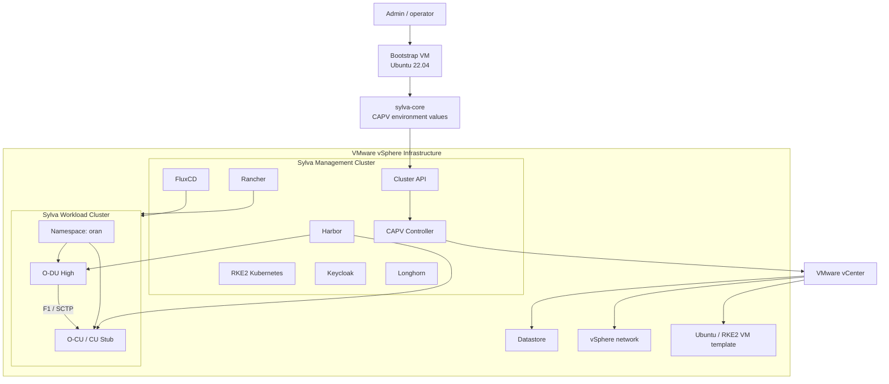

# Sylva OIE Project

This repository documents a VMware CAPV deployment path for Sylva, followed by onboarding Open RAN O-DU and O-CU workloads on top of the Sylva-managed Kubernetes environment.

For bare-metal deployment with CAPM3, see [docs/baremetal/README.md](docs/baremetal/README.md).

## Project Workflow


## Architecture Design



## Overview

This guide explains how to deploy a Sylva management Kubernetes cluster on VMware vSphere using Cluster API Provider vSphere, also known as CAPV.

The deployment includes:

- Bootstrap VM preparation
- Required tool installation
- Sylva repository setup
- VMware values configuration
- Secrets configuration
- YAML validation
- Management cluster deployment
- Deployment verification
- Rancher and Kubernetes access
- O-DU and O-CU workload installation

## Architecture Overview

```text
Bootstrap VM
    |
    |----> Sylva deployment
                |
                |----> Cluster API
                            |
                            |----> CAPV (vSphere)
                                        |
                                        |----> Management cluster
                                                    |
                                                    |----> RKE2 Kubernetes
                                                    |----> Rancher
                                                    |----> Keycloak
                                                    |----> Longhorn
                                                    |
                                                    |----> Workload cluster
                                                                |
                                                                |----> O-DU workload
                                                                |----> O-CU workload
```

The recommended production-style model is to keep Sylva platform components on the management cluster and deploy O-DU/O-CU workloads on a separate workload cluster managed by Sylva.

## Prerequisites

### Bootstrap VM Requirements

| Component | Recommended |
| --- | --- |
| OS | Ubuntu 22.04 LTS |
| CPU | 4+ vCPUs |
| RAM | 8 GB minimum, 16 GB recommended |
| Disk | 40 GB minimum, 50 GB recommended |
| Access | Passwordless sudo and SSH access |

If using OpenStack instead of VMware, ensure the bootstrap VM is on the same tenant and network as the management cluster VMs.

### VMware Environment Requirements

Minimum management cluster:

- 3 control plane VMs
- 4 vCPUs per VM
- 8 GB RAM per VM
- 50 GB disk per VM

Required VMware access:

- vCenter Server access
- Datacenter permissions
- Datastore permissions
- Network creation or network access permissions
- VM template or image access
- Enough CPU, memory, and storage quota for the management cluster

### O-DU and O-CU Workload Requirements

Minimum lab sizing:

- O-DU High: 4 CPUs and 8 GB RAM
- O-CU or CU stub: 2 to 4 CPUs and 4 to 8 GB RAM
- Additional disk space for container images and logs

Recommended networking for first lab:

- Start with Kubernetes service networking or host networking.
- Move to Multus, SR-IOV, hugepages, DPDK, PTP, and real-time kernel tuning for a more realistic RAN lab.

## Step 1: Update Ubuntu

```bash
sudo apt update
sudo apt upgrade -y
```

## Step 2: Install Required Packages

```bash
sudo apt install -y \
    curl \
    wget \
    git \
    vim \
    jq \
    unzip \
    tar \
    make \
    python3 \
    python3-pip \
    ca-certificates \
    gnupg \
    lsb-release \
    yamllint
```

## Step 3: Install Docker

Remove old Docker packages:

```bash
sudo apt remove docker docker-engine docker.io containerd runc -y
```

Add the Docker repository:

```bash
sudo mkdir -p /etc/apt/keyrings

curl -fsSL https://download.docker.com/linux/ubuntu/gpg | \
sudo gpg --dearmor -o /etc/apt/keyrings/docker.gpg

echo \
"deb [arch=$(dpkg --print-architecture) \
signed-by=/etc/apt/keyrings/docker.gpg] \
https://download.docker.com/linux/ubuntu \
$(lsb_release -cs) stable" | \
sudo tee /etc/apt/sources.list.d/docker.list > /dev/null
```

Install Docker:

```bash
sudo apt update
sudo apt install -y docker-ce docker-ce-cli containerd.io
```

Enable Docker:

```bash
sudo systemctl enable docker
sudo systemctl start docker
```

Add your user to the Docker group:

```bash
sudo usermod -aG docker $USER
newgrp docker
```

Verify:

```bash
docker version
docker ps
```

## Step 4: Install kubectl

```bash
curl -LO "https://dl.k8s.io/release/$(curl -L -s \
https://dl.k8s.io/release/stable.txt)/bin/linux/amd64/kubectl"

chmod +x kubectl
sudo mv kubectl /usr/local/bin/
```

Verify:

```bash
kubectl version --client
```

## Step 5: Install Helm

```bash
curl https://raw.githubusercontent.com/helm/helm/main/scripts/get-helm-3 | bash
```

Verify:

```bash
helm version
```

## Step 6: Install clusterctl

```bash
curl -L https://github.com/kubernetes-sigs/cluster-api/releases/latest/download/clusterctl-linux-amd64 \
-o clusterctl

chmod +x clusterctl
sudo mv clusterctl /usr/local/bin/
```

Verify:

```bash
clusterctl version
```

## Step 7: Install yq

```bash
sudo wget https://github.com/mikefarah/yq/releases/latest/download/yq_linux_amd64 \
-O /usr/local/bin/yq

sudo chmod +x /usr/local/bin/yq
```

Verify:

```bash
yq --version
```

## Step 8: Install Python YAML Tools

```bash
python3 -m pip install --user PyYAML yamllint
yamllint --version
```

## Step 9: Clone Sylva Repository

```bash
git clone https://gitlab.com/sylva-projects/sylva-core.git
cd sylva-core
```

For repeatable deployments, pin a tested Sylva release:

```bash
git tag --list
git checkout <tested-sylva-release>
```

## Step 10: Create the Ubuntu/RKE2 VM Template in vSphere

Create the VM template before configuring `values.yaml`. CAPV uses this template to clone the Sylva management cluster VMs and workload cluster VMs.

The template name must match the value you later set in:

```yaml
capv:
  image_name: "ubuntu-2204-kube-v1.30"
```

### 10.1 Create a New VM in vSphere

In the vSphere Client:

1. Go to **vCenter > Datacenter > Cluster or Host**.
2. Select **Create / Register VM**.
3. Choose **Create a new virtual machine**.
4. Use a clear name, for example:

```text
ubuntu-2204-kube-v1.30
```

5. Select the target datacenter, cluster or ESXi host, datastore, and VM network.

Recommended VM settings:

| Setting | Value |
| --- | --- |
| Guest OS | Ubuntu Linux 64-bit |
| OS version | Ubuntu 22.04 LTS |
| CPU | 4 vCPU |
| RAM | 8 GB |
| Disk | 50 GB |
| Network | Same network the Kubernetes nodes will use |
| Firmware | BIOS or EFI, depending on your environment |
| SSH | Enabled |

### 10.2 Install Ubuntu 22.04

Attach the Ubuntu 22.04 ISO and install the operating system.

During installation:

- Create a normal admin user, for example `ubuntu`.
- Enable OpenSSH server.
- Use DHCP for the first lab unless your network requires static IPs.
- Make sure DNS and internet access work.

After the VM boots, log in through SSH:

```bash
ssh ubuntu@<template-vm-ip>
```

### 10.3 Prepare the Template Operating System

Run these commands inside the template VM:

```bash
sudo apt update
sudo apt upgrade -y
sudo apt install -y \
    cloud-init \
    open-vm-tools \
    openssh-server \
    curl \
    ca-certificates \
    sudo
```

Enable SSH and VMware tools:

```bash
sudo systemctl enable ssh
sudo systemctl enable open-vm-tools
sudo systemctl start ssh
sudo systemctl start open-vm-tools
```

Allow passwordless sudo for the admin user if your Sylva/CAPV flow requires it:

```bash
echo "ubuntu ALL=(ALL) NOPASSWD:ALL" | sudo tee /etc/sudoers.d/90-ubuntu
sudo chmod 440 /etc/sudoers.d/90-ubuntu
```

### 10.4 Add SSH Public Key Access

From the Bootstrap VM, create or reuse an SSH key:

```bash
ssh-keygen -t rsa -b 4096 -f ~/.ssh/sylva-capv -N ""
cat ~/.ssh/sylva-capv.pub
```

Copy the public key into the template VM user's `authorized_keys`:

```bash
mkdir -p ~/.ssh
chmod 700 ~/.ssh
echo "<paste-your-public-key-here>" >> ~/.ssh/authorized_keys
chmod 600 ~/.ssh/authorized_keys
```

Test SSH from the Bootstrap VM:

```bash
ssh -i ~/.ssh/sylva-capv ubuntu@<template-vm-ip>
```

The public key content is the value you later place in `values.yaml`:

```yaml
capv:
  ssh_key: "ssh-rsa AAAAB3Nza..."
```

### 10.5 Clean the VM Before Converting to Template

Inside the template VM, clean machine-specific data:

```bash
sudo cloud-init clean --logs
sudo rm -f /etc/machine-id
sudo touch /etc/machine-id
sudo rm -f /var/lib/dbus/machine-id
sudo ln -s /etc/machine-id /var/lib/dbus/machine-id
history -c
```

Shut down the VM:

```bash
sudo shutdown -h now
```

### 10.6 Convert the VM to a vSphere Template

In the vSphere Client:

1. Right-click the powered-off VM.
2. Select **Template > Convert to Template**.
3. Confirm the template name is exactly:

```text
ubuntu-2204-kube-v1.30
```

If your vSphere environment uses VM templates differently, keep the VM as a cloneable golden image, but make sure CAPV can find it by the `image_name` value.

### 10.7 Verify the Template

Before running Sylva, confirm:

- The template exists in the same vCenter and datacenter used by Sylva.
- The template is visible to the vCenter user in `secrets.yaml`.
- The template can connect to the selected VM network.
- The datastore has enough free space.
- The Bootstrap VM can reach vCenter.
- DNS and NTP are working.

The relationship is:

```text
ubuntu-2204-kube-v1.30 template
        |
        | cloned by CAPV
        v
Sylva management VM 1
Sylva management VM 2
Sylva management VM 3
Workload cluster VMs
```

## Step 11: Create VMware Environment Folder

```bash
cp -r environment-values/rke2-capv/ environment-values/my-rke2-capv
cd environment-values/my-rke2-capv
```

If your selected Sylva release uses a different CAPV sample path, inspect the available environment values:

```bash
ls ../../environment-values
```

## Step 12: Configure values.yaml

Edit:

```bash
vim values.yaml
```

Example configuration:

```yaml
name: sylva-management

k8s_version: v1.30.1+rke2r1

control_plane_replicas: 3

capi_providers:
  infra_provider: capv
  bootstrap_provider: cabpr

capv:
  server: "vcenter.example.local"
  username: "administrator@vsphere.local"
  password: "VMwarePassword"
  dataCenter: "Datacenter"
  dataStore: "Datastore01"
  image_name: "ubuntu-2204-kube-v1.30"
  ssh_key: "ssh-rsa AAAAB3Nza..."
  networks:
    default:
      networkName: "VM Network"

enable_longhorn: true

ntp:
  servers:
    - "0.pool.ntp.org"
    - "1.pool.ntp.org"

units:
  rancher:
    enabled: true
  keycloak:
    enabled: true
  longhorn:
    enabled: true
  harbor:
    enabled: true
  vault:
    enabled: true
```

Replace all example values with your real vSphere settings.

## Step 13: Configure secrets.yaml

Edit:

```bash
vim secrets.yaml
```

Example:

```yaml
cluster:
  capv:
    vcenter:
      server: "vcenter.example.local"
      username: "administrator@vsphere.local"
      password: "YourSecurePassword"
      insecure: true
```

Do not commit real credentials to Git.

## Step 14: Optional Proxy Configuration

If the deployment uses proxy servers, add proxy settings to the environment values:

```yaml
proxies:
  http_proxy: "http://proxy.example.com:8080"
  https_proxy: "http://proxy.example.com:8080"
  no_proxy: "127.0.0.1,localhost"

sylva_base_oci_registry: oci://my-private-registry/proxy_cache_registry.gitlab.com/sylva-projects
oci_registry_insecure: true
```

Add vCenter, Kubernetes API addresses, service CIDRs, pod CIDRs, and internal domains to `no_proxy` when required.

## Step 15: Validate YAML Files

```bash
yamllint values.yaml
yamllint secrets.yaml
```

## Step 16: Bootstrap Sylva

Return to the Sylva repository root:

```bash
cd ../../
```

Run the deployment:

```bash
make all ENV=environment-values/my-rke2-capv
```

This step installs and configures:

- Cluster API
- CAPV
- RKE2
- Rancher
- Keycloak
- Longhorn
- Supporting Sylva infrastructure

## Step 17: Monitor Deployment

Watch pods:

```bash
kubectl get pods -A -w
```

Watch Cluster API resources:

```bash
kubectl get clusters -A
kubectl get machines -A
kubectl get vspheremachines -A
```

## Step 18: Get Management Cluster Kubeconfig

```bash
kubectl get secret sylva-management-kubeconfig \
-o jsonpath='{.data.value}' | base64 -d > management-cluster.kubeconfig
```

Set kubeconfig:

```bash
export KUBECONFIG=$(pwd)/management-cluster.kubeconfig
```

Verify:

```bash
kubectl get nodes
```

## Step 19: Verify the Management Cluster

```bash
kubectl get nodes -o wide
kubectl get pods -A
kubectl cluster-info
kubectl get sylvaunits -A
kubectl get gitrepositories -A
```

## Step 20: Access Rancher

Get the Rancher URL:

```bash
kubectl get ingress -A
```

Example:

```text
https://rancher.example.local
```

Get the Rancher bootstrap password:

```bash
kubectl get secret bootstrap-secret \
-n cattle-system \
-o go-template='{{.data.bootstrapPassword|base64decode}}'
```

## Step 21: Access Keycloak

Get the Keycloak ingress:

```bash
kubectl get ingress -A | grep keycloak
```

Get the admin password:

```bash
kubectl get secret keycloak \
-n keycloak \
-o jsonpath="{.data.admin-password}" | base64 -d
```

## Step 22: Create or Select the Workload Cluster

The recommended target for O-DU and O-CU is a Sylva-managed workload cluster, not the management cluster.

If the workload cluster is already created, export its kubeconfig and continue to the O-RAN workload steps.

If a workload cluster still needs to be created, inspect the available workload examples:

```bash
ls environment-values/workload-clusters
```

Copy the CAPV workload sample that matches your Sylva release:

```bash
cp -r environment-values/workload-clusters/<capv-workload-sample> environment-values/workload-clusters/oran-workload
```

Edit:

```bash
vim environment-values/workload-clusters/oran-workload/values.yaml
vim environment-values/workload-clusters/oran-workload/secrets.yaml
```

Deploy the workload cluster using the workflow supported by your Sylva release:

```bash
make workload-cluster ENV=environment-values/workload-clusters/oran-workload
```

If your selected release provides a script instead, use it:

```bash
./apply-workload-cluster.sh environment-values/workload-clusters/oran-workload
```

Validate:

```bash
kubectl get clusters -A
kubectl get machines -A
```

Switch to the workload cluster kubeconfig before installing O-DU/O-CU.

## Step 23: Prepare O-DU and O-CU Images

Choose one of these image strategies:

- Use prebuilt O-RAN SC images when available for your selected release.
- Build O-DU and O-CU images from source.
- Use CU/O-RU/RIC stubs for a first lab if a full O-CU is not ready.

Create a namespace for the RAN workloads:

```bash
kubectl create namespace oran
```

Log in to Harbor or your selected registry:

```bash
docker login harbor.example.local
```

Tag and push the tested images:

```bash
docker tag <odu-source-image> harbor.example.local/oran/o-du:<tag>
docker tag <ocu-source-image> harbor.example.local/oran/o-cu:<tag>

docker push harbor.example.local/oran/o-du:<tag>
docker push harbor.example.local/oran/o-cu:<tag>
```

For a first lab, you can use stubs:

```bash
docker tag <cu-stub-source-image> harbor.example.local/oran/o-cu-stub:<tag>
docker push harbor.example.local/oran/o-cu-stub:<tag>
```

## Step 24: Create O-DU and O-CU Configuration

Create ConfigMaps for the O-DU and O-CU runtime configuration:

```bash
kubectl create configmap o-du-config \
  -n oran \
  --from-file=odu-config.yaml=./config/odu-config.yaml

kubectl create configmap o-cu-config \
  -n oran \
  --from-file=ocu-config.yaml=./config/ocu-config.yaml
```

Create secrets for credentials or management endpoints:

```bash
kubectl create secret generic oran-secrets \
  -n oran \
  --from-literal=o1-username=<username> \
  --from-literal=o1-password=<password>
```

Recommended configuration items:

- PLMN
- TAC
- gNB ID
- Cell ID
- O-DU F1 interface settings
- O-CU F1 interface settings
- Optional E2/RIC endpoint
- Optional O1 NETCONF settings

## Step 25: Deploy O-CU

Create `o-cu-deployment.yaml`:

```yaml
apiVersion: apps/v1
kind: Deployment
metadata:
  name: o-cu
  namespace: oran
spec:
  replicas: 1
  selector:
    matchLabels:
      app: o-cu
  template:
    metadata:
      labels:
        app: o-cu
    spec:
      containers:
        - name: o-cu
          image: harbor.example.local/oran/o-cu:<tag>
          imagePullPolicy: IfNotPresent
          ports:
            - containerPort: 38472
              name: f1-c
              protocol: SCTP
          volumeMounts:
            - name: config
              mountPath: /etc/oran
      volumes:
        - name: config
          configMap:
            name: o-cu-config
```

Create `o-cu-service.yaml`:

```yaml
apiVersion: v1
kind: Service
metadata:
  name: o-cu
  namespace: oran
spec:
  selector:
    app: o-cu
  ports:
    - name: f1-c
      port: 38472
      targetPort: 38472
      protocol: SCTP
```

Apply:

```bash
kubectl apply -f o-cu-deployment.yaml
kubectl apply -f o-cu-service.yaml
```

For a stub-based lab, replace the image with the CU stub image and keep the same service name so the O-DU can resolve `o-cu.oran.svc.cluster.local`.

## Step 26: Deploy O-DU

Create `o-du-deployment.yaml`:

```yaml
apiVersion: apps/v1
kind: Deployment
metadata:
  name: o-du
  namespace: oran
spec:
  replicas: 1
  selector:
    matchLabels:
      app: o-du
  template:
    metadata:
      labels:
        app: o-du
    spec:
      containers:
        - name: o-du
          image: harbor.example.local/oran/o-du:<tag>
          imagePullPolicy: IfNotPresent
          env:
            - name: O_CU_HOST
              value: "o-cu.oran.svc.cluster.local"
            - name: O_CU_F1_PORT
              value: "38472"
          ports:
            - containerPort: 38472
              name: f1-c
              protocol: SCTP
          volumeMounts:
            - name: config
              mountPath: /etc/oran
      volumes:
        - name: config
          configMap:
            name: o-du-config
```

Apply:

```bash
kubectl apply -f o-du-deployment.yaml
```

If the selected O-DU image requires host networking, hugepages, DPDK, SCTP kernel modules, or privileged access, add those settings only after validating the base pod startup.

## Step 27: Optional GitOps Deployment

For a Sylva-style workflow, store the O-DU and O-CU manifests in Git and reconcile them with Flux.

Recommended structure:

```text
gitops/
  clusters/
    oran-workload/
      kustomization.yaml
      oran/
        namespace.yaml
        o-cu-deployment.yaml
        o-cu-service.yaml
        o-du-deployment.yaml
        configmaps.yaml
        secrets.yaml
```

Check reconciliation:

```bash
flux get sources git -A
flux get kustomizations -A
```

## Step 28: Verify O-DU and O-CU

Check namespace resources:

```bash
kubectl get all -n oran
kubectl get pods -n oran -o wide
```

Check logs:

```bash
kubectl logs -n oran deploy/o-cu
kubectl logs -n oran deploy/o-du
```

Check service discovery:

```bash
kubectl get svc -n oran
kubectl describe svc o-cu -n oran
```

Check resource usage:

```bash
kubectl top pods -n oran
```

Success criteria:

- Workload cluster is healthy.
- `oran` namespace exists.
- O-CU pod is running.
- O-DU pod is running.
- O-DU can resolve and reach the O-CU service.
- Logs show successful O-DU to O-CU startup or attach flow.
- Monitoring shows CPU, memory, and pod status.

## Troubleshooting Commands

Check all resources:

```bash
kubectl get all -A
```

Describe a failed pod:

```bash
kubectl describe pod <pod-name> -n <namespace>
```

View logs:

```bash
kubectl logs <pod-name> -n <namespace>
```

Check Cluster API objects:

```bash
kubectl get clusters,machinesets,machinedeployments,machines -A
```

Check CAPV logs:

```bash
kubectl logs -n capv-system deployment/capv-controller-manager
```

Check all namespaces:

```bash
kubectl get ns
```

Restart a deployment:

```bash
kubectl rollout restart deployment <deployment> -n <namespace>
```

Delete a failed machine:

```bash
kubectl delete machine <machine-name>
```

## Common Issues

### VMware Authentication Failure

Check:

- vCenter username and password
- Datacenter permissions
- Datastore access
- Network access permissions

### VM Creation Fails

Verify:

- VM template exists
- Network exists
- Datastore has free space
- CPU and RAM quotas are available

### Kubernetes Nodes Not Joining

Check:

```bash
kubectl describe machine <machine-name>
```

Also verify:

- DHCP and network access
- DNS
- NTP synchronization
- Firewall rules

### O-DU or O-CU Pod Fails

Check:

- Image name and registry credentials
- ConfigMap and Secret names
- SCTP support on Kubernetes nodes
- Required ports and service names
- CPU and memory limits
- Host networking requirements
- Privileged mode requirements
- Hugepages, DPDK, SR-IOV, and PTP requirements for advanced labs

## Recommended Sylva Add-ons

| Unit | Purpose |
| --- | --- |
| Rancher | Kubernetes management |
| Keycloak | Identity management |
| Longhorn | Distributed storage |
| Harbor | Container registry |
| Vault | Secrets management |
| FluxCD | GitOps |
| Thanos | Monitoring |

## Cleanup

Delete the management cluster:

```bash
kubectl delete cluster sylva-management
```

Remove the cloned Sylva repository:

```bash
cd ..
rm -rf sylva-core
```

## References

- Sylva core repository: https://gitlab.com/sylva-projects/sylva-core
- Sylva documentation: https://sylva-projects.gitlab.io/docs/
- Cluster API project: https://cluster-api.sigs.k8s.io/
- Rancher: https://www.rancher.com/
- Longhorn: https://longhorn.io/
- O-RAN SC documentation: https://docs.o-ran-sc.org/
