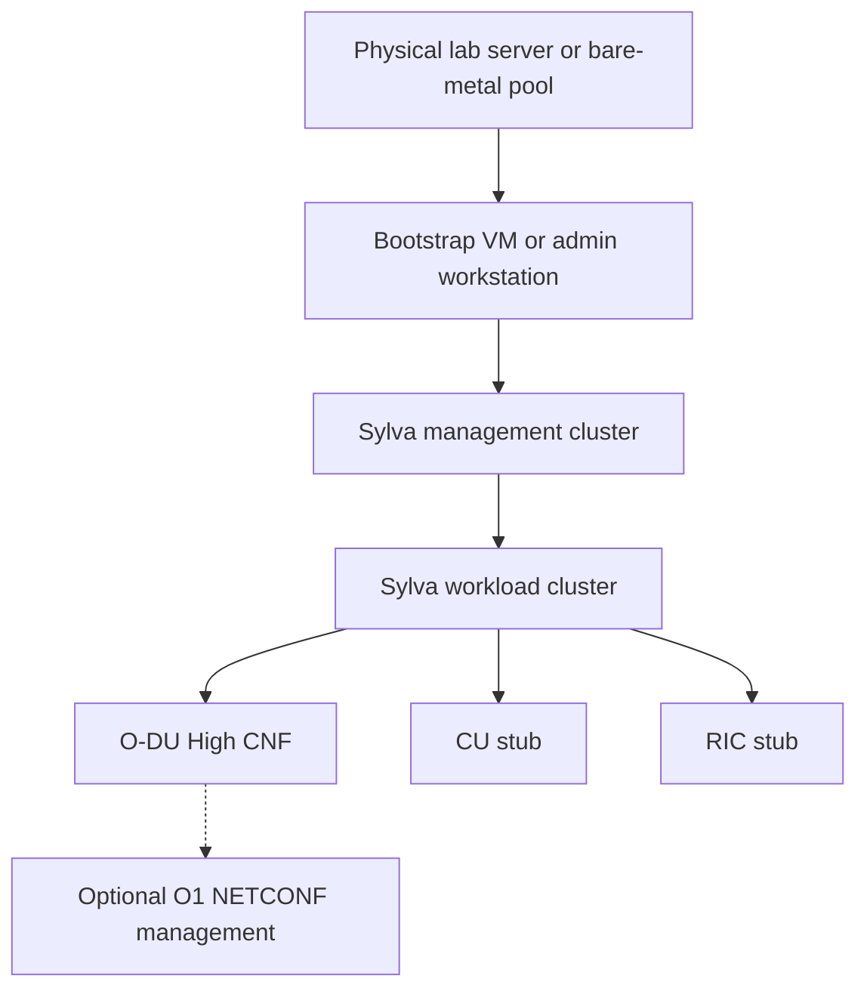

# Sylva Telco Cloud O-DU Lab

This repository documents a lab architecture for deploying a Sylva telco cloud platform and onboarding an Open RAN O-DU workload as a cloud-native network function.

The first implementation target is documentation only: requirements, build steps, and the reference architecture. Runtime manifests, Helm charts, and GitOps repositories can be added after the platform design is approved.

## Project Goal

Build a Sylva-based telco cloud environment with:

- One Sylva management cluster for lifecycle management, Rancher, Cluster API, Flux, Harbor, Vault, Keycloak, and observability.
- One Sylva workload cluster for telecom CNF workloads.
- An O-RAN O-DU High workload deployed on the workload cluster, initially with CU and RIC stubs for lab validation.

See [docs/architecture.md](docs/architecture.md) for the detailed architecture.

## Target Architecture



## Requirements

### Hardware

| Environment | Minimum | Recommended for this project | Notes |
| --- | --- | --- | --- |
| Bootstrap VM | 4 vCPU, 8 GB RAM, 40 GB disk | 4+ vCPU, 16 GB RAM, 50+ GB disk | Runs the deployment tooling and bootstrap cluster. |
| CAPD dev or sandbox | 8 vCPU, 32 GB RAM, 100 GB disk | 16 vCPU, 64 GB RAM, 128+ GB disk | Docker-based local testing only. |
| Bare metal production lab | 16 cores, 32 GB RAM per node | 64 vCPU, 256 GB RAM total or more | Use at least 3 management nodes for HA. |
| O-DU High workload only | 4 CPU, 8 GB RAM | Add this on top of Sylva capacity | Lab O-DU sizing depends on selected O-DU mode and interfaces. |

### Network

- Internet access from the bootstrap VM for container images, Helm charts, and Git repositories.
- Reachability from the bootstrap VM to the target provider APIs or bare-metal BMC interfaces.
- DNS or `/etc/hosts` entries for Sylva services such as `rancher.sylva`, `harbor.sylva`, `keycloak.sylva`, and `vault.sylva`.
- A free `cluster_virtual_ip` for the management cluster API or ingress, depending on the selected provider.
- Separate management, workload, and BMC networks for bare-metal deployments.

### Software

Install these on the bootstrap VM or admin workstation:

- Ubuntu 22.04 LTS or another supported Linux distribution.
- Docker Engine, latest stable release. Docker 20.10+ is the baseline for CAPD labs.
- `git`
- `curl`
- `kubectl`
- `yq` v4+
- `jq`
- `python3`
- `pip`
- Python packages: `PyYAML`, `yamllint`

Optional but useful:

- `helm`
- `kind`
- `flux`
- `make`

Verify the local toolchain:

```bash
docker version
git --version
kubectl version --client
yq --version
python3 --version
pip --version
yamllint --version
```

## Provider Options

| Provider | Use case | Infrastructure |
| --- | --- | --- |
| CAPD | Development and sandbox testing | Kubernetes clusters run as Docker containers on one Linux host. |
| CAPM3 | Production edge or telco bare metal | Kubernetes clusters are deployed directly to bare-metal nodes through Metal3, PXE, and BMC control. |
| CAPO | Private cloud | Kubernetes clusters are deployed on OpenStack. |
| CAPV | VMware private cloud | Kubernetes clusters are deployed on vSphere. |
| CAPONE | OpenNebula private cloud | Kubernetes clusters are deployed on OpenNebula. |

For the first lab build, use CAPD if the goal is a fast local demonstration. Use CAPM3 if the goal is a realistic telco edge or bare-metal project.

## Build Steps

### 1. Prepare the Bootstrap Host

Install the required tools and Python packages:

```bash
sudo apt update
sudo apt install -y git curl jq python3 python3-pip python3-venv
python3 -m pip install --user PyYAML yamllint
```

Install Docker, `kubectl`, and `yq` using your organization-approved method or the official upstream packages. After installation, confirm that the user can run Docker without `sudo`.

```bash
docker ps
```

### 2. Clone Sylva Core

```bash
git clone https://gitlab.com/sylva-projects/sylva-core.git
cd sylva-core
```

For repeatable results, pin the project to the release you tested:

```bash
git tag --list
git checkout <tested-sylva-release>
```

### 3. Select the Provider

Choose the provider folder that matches the target environment. The exact sample folder name can change by Sylva release, so inspect `environment-values/` after cloning.

Examples:

```bash
ls environment-values
ls environment-values/workload-clusters
```

For a CAPD lab, copy the available CAPD sample into a project-specific folder:

```bash
cp -r environment-values/kubeadm-capd environment-values/my-sylva-mgmt
```

If your Sylva release uses a different CAPD sample path, use the matching folder from `environment-values/`.

For bare metal, OpenStack, or VMware, choose one matching sample:

```bash
cp -r environment-values/rke2-capm3 environment-values/my-sylva-mgmt
cp -r environment-values/rke2-capo environment-values/my-sylva-mgmt
cp -r environment-values/rke2-capv environment-values/my-sylva-mgmt
```

Use only one provider folder for the actual build.

### 4. Configure Management Cluster Values

Edit:

```bash
environment-values/my-sylva-mgmt/values.yaml
environment-values/my-sylva-mgmt/secrets.yaml
```

Set at least:

- Cluster name.
- Provider type.
- Kubernetes version.
- Control plane and worker node counts.
- `cluster_virtual_ip`.
- DNS and ingress settings.
- Proxy settings, if needed.
- Registry mirror settings, if needed.
- Provider credentials in `secrets.yaml`.
- Required Sylva units, such as Rancher, Harbor, Vault, Keycloak, monitoring, and Flux.

Validate YAML before deployment:

```bash
yamllint environment-values/my-sylva-mgmt/values.yaml
yamllint environment-values/my-sylva-mgmt/secrets.yaml
```

### 5. Deploy the Sylva Management Cluster

Current Sylva documentation uses `bootstrap.sh` for the management cluster. Some older notes and branches may refer to `apply.sh`. Use the script that exists in the selected Sylva release.

```bash
ls bootstrap.sh apply.sh
./bootstrap.sh environment-values/my-sylva-mgmt
```

If your selected release uses `apply.sh` instead:

```bash
./apply.sh environment-values/my-sylva-mgmt
```

Watch cluster progress:

```bash
kubectl get events -A -w
kubectl get nodes -w
kubectl get pods -A -w
```

Expected successful result:

```text
All done
```

### 6. Validate the Management Cluster

Export the management kubeconfig:

```bash
export KUBECONFIG=management-cluster-kubeconfig
kubectl get nodes
kubectl get pods -A
kubectl get sylvaunits -A
kubectl get gitrepositories -A
```

Confirm that the core services are reachable:

- Rancher
- Flux or Weave GitOps UI
- Harbor
- Vault
- Keycloak
- Monitoring stack

### 7. Create the Workload Cluster

Create the workload cluster from the sample matching your provider. Inspect the available workload samples first:

```bash
ls environment-values/workload-clusters
cp -r environment-values/workload-clusters/<provider-workload-sample> environment-values/workload-clusters/odu-workload
```

For a CAPD lab, select the available CAPD workload sample in your Sylva release.

Edit the workload cluster values:

```bash
environment-values/workload-clusters/odu-workload/values.yaml
environment-values/workload-clusters/odu-workload/secrets.yaml
```

Deploy the workload cluster:

```bash
./apply-workload-cluster.sh environment-values/workload-clusters/odu-workload
```

Validate:

```bash
kubectl get clusters -A
kubectl get machines -A
kubectl get nodes
```

### 8. Prepare the O-DU Workload

Start with the O-RAN SC O-DU High Docker workflow for lab validation:

```bash
docker pull nexus3.o-ran-sc.org:10004/o-ran-sc/o-du-l2:4.0.1
docker pull nexus3.o-ran-sc.org:10004/o-ran-sc/o-du-l2-cu-stub:4.0.1
```

For Kubernetes deployment, adapt the Docker execution into CNF manifests or a Helm chart:

- Namespace: `oran-odu`
- Workloads: O-DU High, CU stub, RIC stub
- Networking: host networking for the first lab or Multus/SR-IOV for a more realistic RAN setup
- Security: privileged mode only if required by the selected O-DU execution path
- Configuration: ConfigMaps and Secrets for O-DU, CU, RIC, and optional O1 NETCONF settings
- Images: push tested images into Harbor or another trusted registry

Example image promotion flow:

```bash
docker tag nexus3.o-ran-sc.org:10004/o-ran-sc/o-du-l2:4.0.1 harbor.sylva/oran/o-du-l2:4.0.1
docker tag nexus3.o-ran-sc.org:10004/o-ran-sc/o-du-l2-cu-stub:4.0.1 harbor.sylva/oran/o-du-l2-cu-stub:4.0.1
docker push harbor.sylva/oran/o-du-l2:4.0.1
docker push harbor.sylva/oran/o-du-l2-cu-stub:4.0.1
```

### 9. Deploy O-DU by GitOps

Create a GitOps repository or folder for the workload cluster:

```text
gitops/
  clusters/
    odu-workload/
      kustomization.yaml
      oran-odu/
        namespace.yaml
        odu-deployment.yaml
        cu-stub-deployment.yaml
        ric-stub-deployment.yaml
        services.yaml
```

Connect the repository to Flux on the workload cluster, then reconcile it through Sylva or Flux:

```bash
flux get sources git -A
flux get kustomizations -A
flux reconcile kustomization <kustomization-name> -n <namespace> --with-source
```

### 10. Validate the O-DU Lab

```bash
kubectl get ns
kubectl get pods -n oran-odu
kubectl logs -n oran-odu deploy/o-du-high
kubectl logs -n oran-odu deploy/cu-stub
kubectl logs -n oran-odu deploy/ric-stub
kubectl top pods -n oran-odu
```

Success criteria:

- Sylva management cluster is healthy.
- Workload cluster is visible and manageable from Sylva/Rancher.
- O-DU High starts successfully on the workload cluster.
- CU and RIC stubs are running before O-DU starts.
- Logs show the expected O-DU call flow.
- Monitoring shows CPU, memory, and pod health for the O-DU namespace.

## Troubleshooting

- If Sylva deployment hangs, check Flux and controller logs:

```bash
flux logs -n sylva-system
kubectl get pods -A
kubectl describe pod <pod-name> -n <namespace>
```

- If pods are stuck in `CrashLoopBackOff`, check available RAM and CPU first.
- If cluster API access fails, verify `cluster_virtual_ip`, DNS, and firewall rules.
- If CAPD fails, verify Docker is running and the host has enough memory.
- If bare-metal provisioning fails, verify PXE, DHCP, BMC credentials, and Metal3 host status.
- If O-DU fails in Kubernetes but works in Docker, check host networking, privileges, hugepages, DPDK, interface binding, and timing requirements.

## References

- Sylva documentation: https://sylva-projects.gitlab.io/docs/1.5/
- Sylva core repository: https://gitlab.com/sylva-projects/sylva-core
- O-RAN SC O-DU High documentation: https://docs.o-ran-sc.org/projects/o-ran-sc-o-du-l2/
