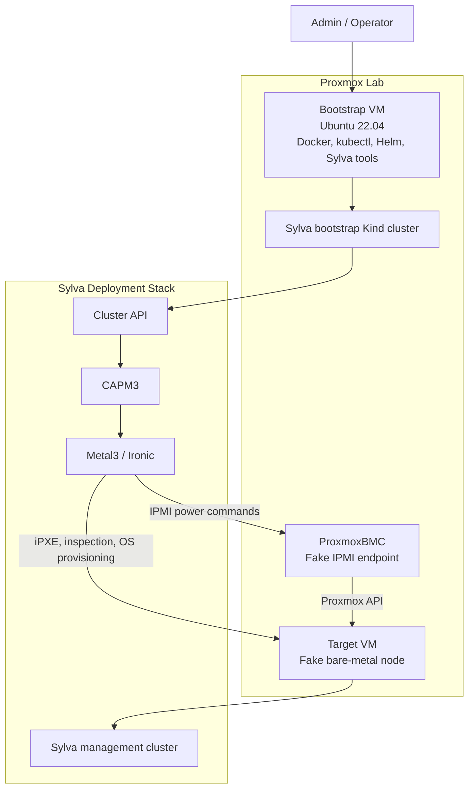

# Proxmox Sylva Deployment Issues And Fixes

This document records the main problems solved while adapting a Sylva bare-metal deployment to a Proxmox lab.

The official bare-metal flow expects physical servers with real BMC access through IPMI or Redfish. In this lab, the target machine was a Proxmox VM, so the deployment had to emulate bare-metal behavior with ProxmoxBMC.

## Lab Adaptation Summary

```text
Official bare-metal model:

Sylva -> Cluster API -> CAPM3 -> Metal3 -> real BMC -> physical server

Proxmox lab model:

Sylva -> Cluster API -> CAPM3 -> Metal3 -> ProxmoxBMC -> Proxmox API -> target VM
```

ProxmoxBMC acts as a fake BMC. Metal3 sends IPMI commands, and ProxmoxBMC translates them into Proxmox API actions such as power on, power off, and boot control for the target VM.

## Final Working Architecture



## Issue 1: Metal3 Could Not Reach The Fake BMC

### Symptom

Metal3 or BareMetalHost registration failed with IPMI connection errors.

The ProxmoxBMC endpoint worked from the bootstrap VM shell, but not from Metal3 pods.

### Root Cause

Metal3 pods were running inside the bootstrap Kind cluster network. The normal bootstrap VM IP was not the correct address from inside the pod network.

### Fix

Use the pod-reachable Docker bridge address for the BMC endpoint:

```yaml
bmc:
  address: ipmi://172.18.0.1:6625
```

Validate from a pod:

```bash
kubectl run ipmi-test \
  -n sylva-system \
  --rm -it \
  --restart=Never \
  --image=ubuntu:22.04 \
  -- bash
```

Inside the pod:

```bash
apt update
apt install -y ipmitool
ipmitool -I lanplus -H 172.18.0.1 -p 6625 -U admin -P password power status
```

## Issue 2: iPXE Could Not Boot Over HTTPS

### Symptom

The target VM reached iPXE, but failed to download the boot script or inspection image over HTTPS.

### Root Cause

The built-in iPXE environment in the Proxmox VM supported HTTP but did not support the HTTPS boot URL provided by Ironic.

### Fix

Copy the Ironic boot files to a temporary HTTP directory and serve them from the bootstrap VM:

```bash
cd /tmp/ironic-http-bootp-boot
python3 -m http.server 8080 --bind 0.0.0.0
```

Expected successful requests:

```text
GET /boot.ipxe 200
GET /inspector.ipxe 200
GET /images/ironic-python-agent-x86_64.kernel 200
GET /images/ironic-python-agent-x86_64.initramfs 200
```

The `pxelinux.cfg` request may return `404`; that was not the blocker as long as `boot.ipxe`, `inspector.ipxe`, kernel, and initramfs returned `200`.

## Issue 3: Wrong Ironic Python Agent Image Name

### Symptom

iPXE requested the wrong architecture, such as an `i386` image, or could not find the image file.

### Root Cause

The generated iPXE script used `${buildarch}`, which resolved incorrectly in the lab.

### Fix

Patch `inspector.ipxe` to use the expected x86_64 image names:

```bash
sed -i 's#ironic-python-agent-${buildarch}#ironic-python-agent-x86_64#g' \
  /tmp/ironic-http-bootp-boot/inspector.ipxe
```

Create both underscore and hyphen file variants:

```bash
cd /tmp/ironic-http-bootp-boot/images
cp ironic-python-agent_x86_64.kernel ironic-python-agent-x86_64.kernel
cp ironic-python-agent_x86_64.initramfs ironic-python-agent-x86_64.initramfs
```

## Issue 4: Kubeconfig Context Confusion

### Symptom

`bootstrap.sh` or `apply.sh` failed because it tried to talk to the management cluster when it should have been using the bootstrap Kind cluster.

Other times, `kubectl` accidentally pointed to the temporary HTTP server and returned `404` for Kubernetes API paths such as `/api` and `/apis`.

### Root Cause

The deployment uses two Kubernetes contexts:

```text
Bootstrap Kind cluster:
  Used for bootstrap, apply, pivot, and initial Sylva deployment flow.

Management cluster:
  Used for checking deployed Sylva services after the management cluster exists.
```

### Fix

For bootstrap or pivot operations:

```bash
unset KUBECONFIG
kind export kubeconfig --name sylva
kubectl get nodes
```

Expected node:

```text
sylva-control-plane
```

For management cluster checks:

```bash
export KUBECONFIG=/tmp/management-cluster.kubeconfig
kubectl get nodes
```

Expected node:

```text
management-cluster-my-server
```

## Issue 5: Longhorn Disk Scheduling Blocked Flux

### Symptom

Flux `source-controller` stayed in `Pending` or `ContainerCreating`.

The PVC was bound, but Longhorn reported:

```text
volume is not ready for workloads
precheck new replica failed: disks are unavailable
```

### Root Cause

Longhorn detected the disk path, but scheduling was disabled on the disk.

### Fix

Use a dedicated Longhorn disk path, not the OS disk:

```yaml
longhorn_disk_config:
  - path: /var/longhorn/disks/sdb
    storageReserved: 0
    allowScheduling: true
```

Patch the Longhorn node if needed:

```bash
kubectl -n longhorn-system patch nodes.longhorn.io management-cluster-my-server --type merge -p '
{
  "spec": {
    "disks": {
      "default-disk-4b3536ec910367f3": {
        "path": "/var/longhorn/disks/sdb",
        "allowScheduling": true,
        "storageReserved": 0,
        "tags": []
      }
    }
  }
}'
```

Then recreate the broken Flux PVC if it was already faulted:

```bash
kubectl -n flux-system delete pod -l app=source-controller
kubectl -n flux-system delete pvc flux-sources-pvc
```

## Issue 6: Longhorn PVC Blocked Metal3 Ironic

### Symptom

The `metal3` HelmRelease kept failing with:

```text
Helm upgrade failed for release metal3-system/metal3: context deadline exceeded
```

The `metal3-ironic` pod was stuck:

```text
metal3-ironic   0/3   Init:0/1
```

Events showed:

```text
FailedAttachVolume
volume ... is not ready for workloads
```

### Root Cause

The Ironic shared PVC used Longhorn. Longhorn could not attach the volume, so the Ironic pod could not start. Because Ironic was not ready, Metal3 stayed unready, then CAPM3 stayed unready, and the pivot job waited.

### Fix

Confirm Metal3 PVC state:

```bash
kubectl -n metal3-system get pvc
kubectl -n metal3-system get pods -o wide
kubectl -n metal3-system get events --sort-by=.lastTimestamp
```

Delete and recreate the stuck Ironic PVC:

```bash
kubectl -n metal3-system delete pod -l app.kubernetes.io/name=metal3-ironic
kubectl -n metal3-system delete pvc ironic-shared-volume
```

If the PVC is stuck terminating:

```bash
kubectl -n metal3-system patch pvc ironic-shared-volume \
  -p '{"metadata":{"finalizers":null}}' \
  --type=merge
```

Reconcile Metal3:

```bash
kubectl -n sylva-system annotate helmrelease metal3 \
  reconcile.fluxcd.io/requestedAt="$(date +%s)" \
  --overwrite

kubectl -n sylva-system annotate kustomization metal3 \
  reconcile.fluxcd.io/requestedAt="$(date +%s)" \
  --overwrite
```

Expected result:

```text
metal3 HelmRelease True
metal3 Kustomization True
capm3 Kustomization True
```

## Issue 7: Pivot Job Appeared Stuck

### Symptom

`bootstrap.sh` refused to run again:

```text
The pivot job is in progress. Please wait for it to finish.
```

The pivot job stayed running:

```text
pivot   Running   0/1
```

### Root Cause

Pivot was waiting for management-cluster Cluster API related kustomizations. The real blocker was Metal3 and CAPM3 readiness, caused by the Metal3 Ironic PVC problem.

### Fix

Do not rerun bootstrap while pivot is running.

Watch pivot from the bootstrap Kind context:

```bash
unset KUBECONFIG
kind export kubeconfig --name sylva
kubectl -n sylva-system logs job/pivot -f
```

Check management-cluster blockers from the management kubeconfig:

```bash
export KUBECONFIG=/tmp/management-cluster.kubeconfig
kubectl get kustomizations -A | grep -E "False|Unknown|InProgress"
kubectl get helmreleases -A | grep -E "False|Unknown|Progressing"
```

After Metal3 and CAPM3 became ready, pivot continued.

## Final Validation

After the fixes, the expected management-cluster state is:

```bash
export KUBECONFIG=/tmp/management-cluster.kubeconfig

kubectl get nodes
kubectl get helmreleases -A
kubectl get kustomizations -A
kubectl -n metal3-system get pods
kubectl -n longhorn-system get pods
kubectl -n flux-system get pods
```

Healthy signs:

```text
management-cluster-my-server   Ready
metal3                         True
capm3                          True
Longhorn pods                  Running
Flux pods                      Running
Sylva units                    Ready
```

## Key Lesson

The Proxmox lab did not fail because Sylva could not support the architecture. The main problems were integration details:

- fake BMC reachability from pod networks
- iPXE HTTPS limitations
- boot image naming
- kubeconfig context switching
- Longhorn volume scheduling and PVC recovery
- pivot waiting on unready Metal3/CAPM3 units

Once those were fixed, the Sylva management cluster deployed successfully on the Proxmox fake bare-metal lab.
