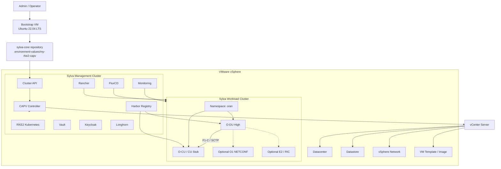
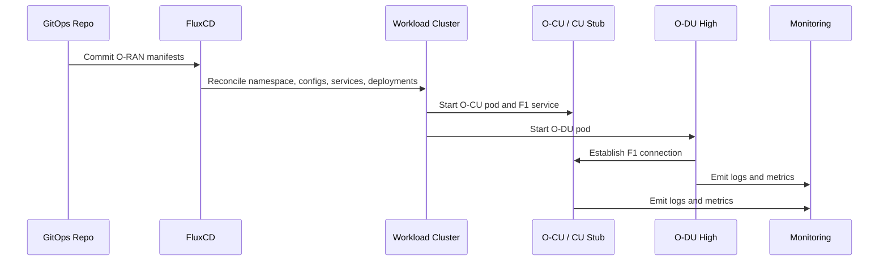
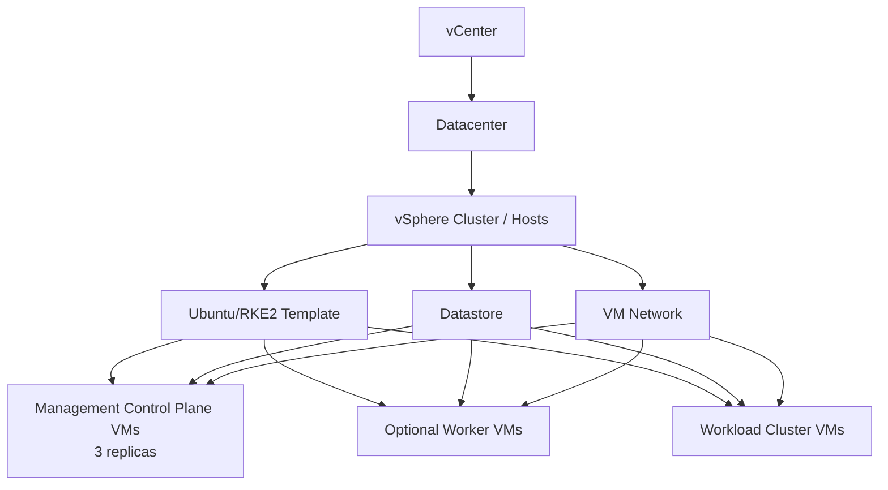

# Sylva VMware CAPV O-RAN Architecture

## Purpose

This architecture defines a practical lab for deploying Sylva on VMware vSphere with Cluster API Provider vSphere, then onboarding Open RAN O-DU and O-CU workloads.

The recommended design separates platform lifecycle management from telecom workload execution:

- The Sylva management cluster runs Cluster API, CAPV, Rancher, GitOps, registry, identity, storage, secrets, and observability services.
- The Sylva workload cluster runs the O-DU and O-CU workloads.

This keeps the management plane stable and gives the O-RAN workloads a dedicated Kubernetes target.

## Deployment Workflow


## Logical Architecture



## O-RAN Workload Design

The first lab deployment can use an O-CU stub or lightweight O-CU container. The goal is to prove that the Sylva workload cluster can host and manage an O-RAN CNF pair.



## Component Roles

| Component | Role |
| --- | --- |
| Bootstrap VM | Runs the Sylva deployment tooling and starts the bootstrap process. |
| vCenter Server | Provides the VMware API endpoint used by CAPV. |
| Datacenter | vSphere location where cluster VMs are created. |
| Datastore | Stores the management and workload cluster VM disks. |
| vSphere Network | Provides VM connectivity for Kubernetes nodes and Sylva services. |
| VM Template / Image | Base image used to create RKE2 Kubernetes nodes. |
| Sylva management cluster | Owns platform lifecycle, cluster lifecycle, GitOps, registry, identity, storage, secrets, and observability. |
| Rancher | Provides Kubernetes cluster management and operator access. |
| Cluster API | Provisions and manages Kubernetes cluster lifecycle. |
| CAPV | Talks to vSphere and creates or manages Kubernetes node VMs. |
| FluxCD | Reconciles declarative platform and workload configuration from Git. |
| Harbor | Stores approved O-DU, O-CU, and platform container images. |
| Vault | Stores secrets when enabled by Sylva units. |
| Keycloak | Provides identity services when enabled by Sylva units. |
| Longhorn | Provides distributed storage for the lab platform. |
| Workload cluster | Runs O-DU, O-CU, and future telecom CNFs. |
| O-CU / CU Stub | Provides the CU-side peer for the O-DU F1 interface. |
| O-DU High | Main Open RAN distributed unit workload for the lab. |
| O1 NETCONF | Optional management interface for configuration and lifecycle demos. |
| E2 / RIC | Optional near-RT RIC integration point. |

## vSphere Resource Model



## Build Phases

### Phase 1: Sylva Management Cluster

Objective:

Deploy Sylva and verify management services.

Deliverables:

- Prepared bootstrap VM.
- Cloned `sylva-core` repository.
- CAPV-specific `environment-values/my-rke2-capv` folder.
- Working management cluster.
- Reachable Rancher, Harbor, Flux, Vault, Keycloak, and monitoring endpoints where enabled.

Validation:

```bash
kubectl get nodes
kubectl get pods -A
kubectl get sylvaunits -A
kubectl get gitrepositories -A
```

### Phase 2: Sylva Workload Cluster

Objective:

Create a workload cluster managed by Sylva.

Deliverables:

- Provider-specific workload cluster values.
- Workload cluster created through Sylva lifecycle tooling.
- Cluster visible in Rancher and Cluster API.

Validation:

```bash
kubectl get clusters -A
kubectl get machines -A
kubectl get nodes
```

### Phase 3: O-CU CNF Onboarding

Objective:

Deploy O-CU or a CU stub first so the O-DU has a stable peer.

Deliverables:

- O-CU or CU stub image selected and tested.
- Images mirrored into Harbor or another trusted registry.
- Kubernetes Service exposing the F1 endpoint.
- ConfigMap and Secret objects prepared.
- GitOps reconciliation path created.

Validation:

```bash
kubectl get pods -n oran
kubectl get svc -n oran
kubectl logs -n oran deploy/o-cu
```

### Phase 4: O-DU CNF Onboarding

Objective:

Deploy O-DU High as a Kubernetes workload on the Sylva workload cluster.

Deliverables:

- O-DU image selected and tested.
- O-DU image mirrored into Harbor or another trusted registry.
- Kubernetes Deployment configured to reach the O-CU service.
- Optional O1 and E2 settings prepared.

Validation:

```bash
kubectl get pods -n oran
kubectl logs -n oran deploy/o-du
kubectl describe svc o-cu -n oran
```

### Phase 5: Telco Cloud Demo

Objective:

Show that Sylva can manage the platform and O-RAN workload lifecycle.

Demo flow:

1. Show the Sylva management cluster.
2. Show the workload cluster in Rancher.
3. Show O-CU and O-DU pods in the workload cluster.
4. Show GitOps reconciliation.
5. Show logs and health metrics.
6. Update an O-DU or O-CU image tag and reconcile the deployment.
7. Show rollback or redeploy if time allows.

## Networking Design

Start with a simple VMware CAPV lab network:

- Kubernetes service networking for pod-to-pod traffic.
- The O-CU Service exposes the F1 endpoint inside the `oran` namespace.
- The O-DU resolves `o-cu.oran.svc.cluster.local`.
- Host networking only if required by the selected O-DU or O-CU image.

Move to a telco-grade network model later:

- Multus for multiple pod interfaces.
- SR-IOV for high-performance data plane interfaces.
- Hugepages and CPU pinning for performance-sensitive workloads.
- DPDK support if required by the O-DU execution path.
- PTP and real-time kernel support for timing-sensitive tests.

## Security Design

Initial lab:

- Keep secrets in Kubernetes Secrets or Vault if enabled.
- Restrict privileged containers to O-RAN components that require them.
- Use a dedicated namespace: `oran`.
- Pull images from Harbor after validation.

Production-style improvement:

- Enforce image scanning and signed images.
- Use network policies between platform and workload namespaces.
- Use least-privilege service accounts.
- Store O-DU/O-CU configuration and credentials in Vault.
- Use GitOps pull requests for all deployment changes.

## Observability Design

Minimum observability:

- Pod status.
- Container logs.
- CPU and memory usage.
- Kubernetes events.

Recommended observability:

- O-RAN namespace dashboard.
- O-DU and O-CU log views.
- Workload cluster capacity dashboard.
- Alerts for `CrashLoopBackOff`, high memory, and node pressure.

## Key Design Decisions

| Decision | Choice | Reason |
| --- | --- | --- |
| O-RAN placement | Workload cluster | Avoids running telecom workloads on the management plane. |
| Infrastructure provider | CAPV | Matches the VMware vSphere target environment. |
| Deployment method | GitOps | Matches Sylva operating model and makes the demo repeatable. |
| Registry | Harbor | Keeps O-DU and O-CU images under platform control. |
| First O-CU mode | O-CU stub or lightweight O-CU | Achievable lab validation before integrating real RAN peers. |
| First O-DU mode | O-DU High | Demonstrates a telco CNF on the Sylva workload cluster. |

## Risks and Constraints

| Risk | Impact | Mitigation |
| --- | --- | --- |
| Sylva resource usage is high | Deployment fails or pods crash | Use enough vSphere CPU, memory, and datastore capacity. |
| vSphere template is not prepared correctly | CAPV cannot create usable nodes | Validate template cloud-init, networking, SSH, and image compatibility before bootstrap. |
| CAPV permissions are incomplete | Machine creation fails | Confirm vCenter, datacenter, datastore, network, and template permissions. |
| O-DU/O-CU images assume host networking or privileges | Kubernetes deployment needs special security and network settings | Start with controlled manifests, then add privileges or host networking only when required. |
| Real RAN timing requirements are strict | Basic VMware lab cannot prove radio-grade behavior | Use advanced networking, CPU pinning, PTP, SR-IOV, and tuned hosts for performance tests. |
| Sylva commands differ by release | Build docs can drift | Pin a Sylva release and record the exact command used. |

## Next Documentation Tasks

- Add the selected Sylva release tag.
- Add the selected Sylva CAPV sample folder path.
- Add the final IP plan and DNS names.
- Add the exact O-DU image tags.
- Add the exact O-CU image tags.
- Add the GitOps repository structure after manifests are created.
- Add screenshots from Rancher, Flux, and Kubernetes validation.
