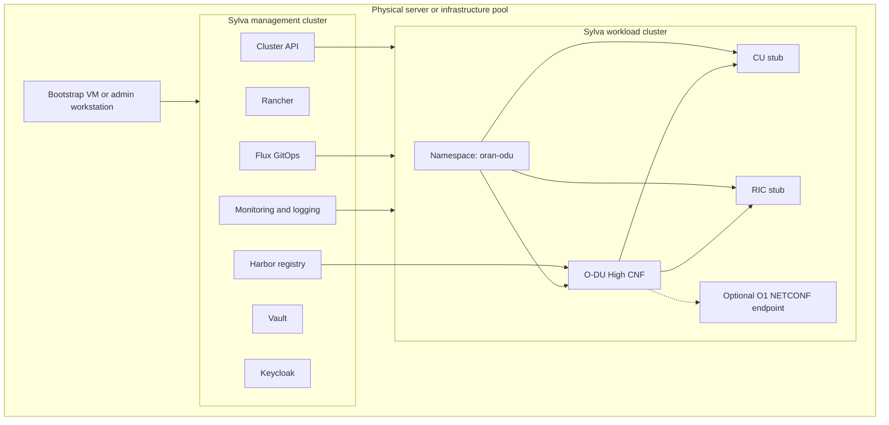

# Sylva Telco Cloud O-DU Architecture

## Purpose

This architecture defines a practical lab for deploying an Open RAN O-DU workload on a Sylva telco cloud platform.

The recommended design separates platform lifecycle management from telecom workload execution:

- The Sylva management cluster runs lifecycle, GitOps, registry, identity, secrets, and observability services.
- The Sylva workload cluster runs the O-DU High CNF and its lab stubs.

This keeps the management plane stable and gives the O-DU workload a dedicated Kubernetes target.

## Logical Architecture



## Component Roles

| Component | Role |
| --- | --- |
| Bootstrap VM | Runs Sylva deployment tooling and starts the bootstrap process. |
| Sylva management cluster | Owns platform lifecycle, cluster lifecycle, GitOps, registry, identity, secrets, and observability. |
| Rancher | Provides Kubernetes cluster management and operator access. |
| Cluster API | Provisions and manages workload cluster lifecycle through CAPD, CAPM3, CAPO, CAPV, or another provider. |
| Flux | Reconciles declarative platform and workload configuration from Git. |
| Harbor | Stores approved O-DU and platform container images. |
| Vault | Stores secrets when enabled by the selected Sylva units. |
| Keycloak | Provides identity services when enabled by the selected Sylva units. |
| Workload cluster | Runs O-DU and future telecom CNFs. |
| O-DU High CNF | Main Open RAN distributed unit workload for the lab. |
| CU stub | Provides a controlled CU-side test peer for the first O-DU validation. |
| RIC stub | Provides a controlled RIC-side test peer for the first O-DU validation. |
| O1 NETCONF endpoint | Optional management interface for later lifecycle and configuration demos. |

## Deployment Model

### Development Model

Use CAPD on one Linux server when the goal is a fast proof of concept.


This model is best for:

- Documentation validation.
- Platform familiarization.
- GitOps workflow testing.
- O-DU container startup validation.

It is not suitable for production RAN performance testing.

### Bare-Metal Model

Use CAPM3 when the goal is a realistic telco edge design.


This model is best for:

- Edge cloud architecture.
- Bare-metal lifecycle management.
- Multus, SR-IOV, hugepages, DPDK, PTP, and real-time kernel experiments.
- More realistic O-RAN integration.

## Build Phases

### Phase 1: Sylva Management Cluster

Objective:

Deploy Sylva and verify management services.

Deliverables:

- Prepared bootstrap VM.
- Cloned `sylva-core` repository.
- Provider-specific `environment-values/my-sylva-mgmt` folder.
- Working management cluster.
- Reachable Rancher, Harbor, Flux, Vault, Keycloak, and monitoring endpoints where enabled.

Validation:

```bash
kubectl get nodes
kubectl get pods -A
kubectl get sylvaunits -A
kubectl get gitrepositories -A
```

### Phase 2: Sylva Workload Cluster

Objective:

Create a workload cluster managed by Sylva.

Deliverables:

- Provider-specific workload cluster values.
- Workload cluster created through Sylva lifecycle tooling.
- Cluster visible in Rancher and Cluster API.

Validation:

```bash
kubectl get clusters -A
kubectl get machines -A
kubectl get nodes
```

### Phase 3: O-DU CNF Onboarding

Objective:

Deploy O-DU High as a Kubernetes workload on the Sylva workload cluster.

Deliverables:

- O-DU image selected and tested.
- CU stub and RIC stub image selected and tested.
- Images mirrored into Harbor or another trusted registry.
- Kubernetes namespace and manifests or Helm chart prepared.
- GitOps reconciliation path created.

Validation:

```bash
kubectl get pods -n oran-odu
kubectl logs -n oran-odu deploy/o-du-high
kubectl logs -n oran-odu deploy/cu-stub
kubectl logs -n oran-odu deploy/ric-stub
```

### Phase 4: Telco Cloud Demo

Objective:

Show that Sylva can manage the platform and O-DU workload lifecycle.

Demo flow:

1. Show the Sylva management cluster.
2. Show the workload cluster in Rancher.
3. Show O-DU, CU stub, and RIC stub pods in the workload cluster.
4. Show GitOps reconciliation.
5. Show logs and health metrics.
6. Update an O-DU image tag and reconcile the deployment.
7. Show rollback or redeploy if time allows.

## Networking Design

Start with a simple CAPD lab network:

- Kubernetes service networking for pod-to-pod traffic.
- Host networking only if required by the O-DU container.
- Simple service discovery between O-DU, CU stub, and RIC stub.

Move to a telco-grade network model later:

- Multus for multiple pod interfaces.
- SR-IOV for high-performance data plane interfaces.
- Hugepages and CPU pinning for performance-sensitive workloads.
- DPDK support if required by the O-DU execution path.
- PTP and real-time kernel support for timing-sensitive tests.

## Security Design

Initial lab:

- Keep secrets in Kubernetes Secrets or Vault if enabled.
- Restrict privileged containers to the O-DU components that require them.
- Use a dedicated namespace: `oran-odu`.
- Pull images from Harbor after validation.

Production-style improvement:

- Enforce image scanning and signed images.
- Use network policies between platform and workload namespaces.
- Use least-privilege service accounts.
- Store O-DU configuration and credentials in Vault.
- Use GitOps pull requests for all deployment changes.

## Observability Design

Minimum observability:

- Pod status.
- Container logs.
- CPU and memory usage.
- Kubernetes events.

Recommended observability:

- O-DU namespace dashboard.
- O-DU, CU stub, and RIC stub log views.
- Workload cluster capacity dashboard.
- Alerts for `CrashLoopBackOff`, high memory, and node pressure.

## Key Design Decisions

| Decision | Choice | Reason |
| --- | --- | --- |
| O-DU placement | Workload cluster | Avoids running telecom workloads on the management plane. |
| First provider | CAPD | Fastest path for a local proof of concept. |
| Production provider | CAPM3 | Best match for telco edge and bare-metal Open RAN labs. |
| Deployment method | GitOps | Matches Sylva operating model and makes the demo repeatable. |
| Registry | Harbor | Keeps O-DU images under platform control. |
| First O-DU mode | O-DU High with CU/RIC stubs | Achievable lab validation before integrating real RAN peers. |

## Risks and Constraints

| Risk | Impact | Mitigation |
| --- | --- | --- |
| Sylva resource usage is high | Deployment fails or pods crash | Use 16 vCPU and 64 GB RAM for the dev lab where possible. |
| CAPD does not represent production networking | O-DU may work in lab but fail with real interfaces | Treat CAPD as phase 1 only; move to CAPM3 for advanced networking. |
| O-DU Docker flow assumes host networking or privileges | Kubernetes deployment needs special security and network settings | Start with controlled lab manifests, then harden after validation. |
| Real RAN timing requirements are strict | CAPD lab cannot prove radio-grade behavior | Use bare metal, tuned kernel, PTP, CPU pinning, and SR-IOV for performance testing. |
| Sylva commands differ by release | Build docs can drift | Pin a Sylva release and record the exact command used. |

## Next Documentation Tasks

- Add the selected Sylva release tag.
- Add the selected provider and sample folder path.
- Add the final IP plan and DNS names.
- Add the exact O-DU image tags.
- Add the GitOps repository structure after manifests are created.
- Add screenshots from Rancher, Flux, and Kubernetes validation.
