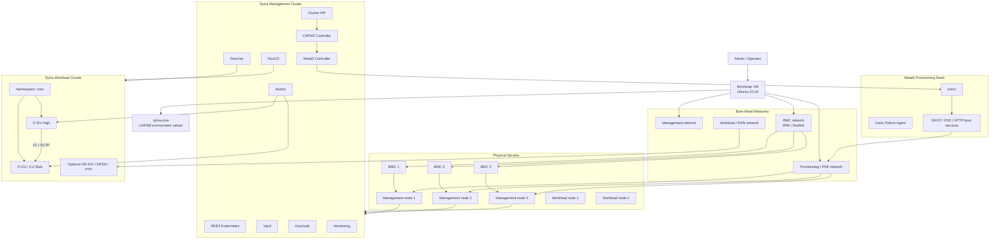

# Sylva Bare-Metal Deployment Guide

This guide explains how to deploy Sylva on bare-metal infrastructure using Cluster API Provider Metal3, also known as CAPM3, then deploy O-DU and O-CU workloads on a Sylva-managed workload cluster.

Use this guide when the target environment is real physical servers instead of VMware VMs.

## Bare-Metal Workflow


## Bare-Metal Architecture



## What You Manually Create

You manually prepare:

- Bootstrap VM
- Physical servers
- BMC access for each server
- Management network
- Provisioning/PXE network
- Optional workload/RAN network
- DHCP/PXE design
- Server inventory

Sylva, Cluster API, CAPM3, and Metal3 then provision the management and workload cluster nodes.

## Requirements

### Bootstrap VM

| Component | Recommended |
| --- | --- |
| OS | Ubuntu 22.04 LTS |
| CPU | 4+ vCPU |
| RAM | 16 GB |
| Disk | 50+ GB |
| Access | SSH and passwordless sudo |
| Network | Access to management, provisioning, and BMC networks |

### Bare-Metal Servers

Minimum management cluster:

- 3 physical servers for management control plane
- 4+ CPU cores per server
- 16 GB RAM per server
- 100 GB disk per server
- One or more NICs per server
- BMC access through IPMI or Redfish

Recommended lab:

- 3 management servers
- 2 or more workload servers
- 8+ CPU cores per server
- 32+ GB RAM per server
- 250+ GB disk per server
- Separate NICs or VLANs for provisioning, management, and workload traffic

### Network Requirements

| Network | Purpose |
| --- | --- |
| Management network | Kubernetes API, node management, Rancher, Sylva services |
| Provisioning network | PXE boot, DHCP, Ironic provisioning, image download |
| BMC network | IPMI or Redfish access to power-cycle and provision servers |
| Workload/RAN network | O-DU/O-CU traffic and optional RAN interfaces |

You need:

- DHCP or static IP plan for bare-metal nodes
- Free virtual IP for Kubernetes API or ingress, depending on your Sylva configuration
- DNS entries or `/etc/hosts` records for Sylva services
- NTP reachable from every node
- Internet or registry mirror access for images
- Firewall rules allowing bootstrap VM to reach BMCs and provisioning services

### Server Inventory

Collect this information before deployment:

| Field | Example |
| --- | --- |
| Server name | `bm-mgmt-01` |
| BMC address | `192.168.100.11` |
| BMC type | `ipmi` or `redfish` |
| BMC username | `admin` |
| BMC password | Stored in `secrets.yaml` |
| Boot MAC address | `52:54:00:aa:bb:cc` |
| Provisioning NIC | `eno1` |
| Management IP | `192.168.10.21` |
| Role | Management or workload |

## Step 1: Prepare the Bootstrap VM

Run all Sylva commands from the Bootstrap VM.

```bash
sudo apt update
sudo apt upgrade -y
sudo apt install -y \
    curl \
    wget \
    git \
    vim \
    jq \
    unzip \
    tar \
    make \
    python3 \
    python3-pip \
    ca-certificates \
    gnupg \
    lsb-release \
    yamllint
```

Install Docker:

```bash
sudo apt remove docker docker-engine docker.io containerd runc -y
sudo mkdir -p /etc/apt/keyrings

curl -fsSL https://download.docker.com/linux/ubuntu/gpg | \
sudo gpg --dearmor -o /etc/apt/keyrings/docker.gpg

echo \
"deb [arch=$(dpkg --print-architecture) \
signed-by=/etc/apt/keyrings/docker.gpg] \
https://download.docker.com/linux/ubuntu \
$(lsb_release -cs) stable" | \
sudo tee /etc/apt/sources.list.d/docker.list > /dev/null

sudo apt update
sudo apt install -y docker-ce docker-ce-cli containerd.io
sudo systemctl enable docker
sudo systemctl start docker
sudo usermod -aG docker $USER
newgrp docker
```

Install `kubectl`, `helm`, `clusterctl`, and `yq`:

```bash
curl -LO "https://dl.k8s.io/release/$(curl -L -s \
https://dl.k8s.io/release/stable.txt)/bin/linux/amd64/kubectl"
chmod +x kubectl
sudo mv kubectl /usr/local/bin/

curl https://raw.githubusercontent.com/helm/helm/main/scripts/get-helm-3 | bash

curl -L https://github.com/kubernetes-sigs/cluster-api/releases/latest/download/clusterctl-linux-amd64 \
-o clusterctl
chmod +x clusterctl
sudo mv clusterctl /usr/local/bin/

sudo wget https://github.com/mikefarah/yq/releases/latest/download/yq_linux_amd64 \
-O /usr/local/bin/yq
sudo chmod +x /usr/local/bin/yq
```

Verify:

```bash
docker version
kubectl version --client
helm version
clusterctl version
yq --version
yamllint --version
```

## Step 2: Prepare Bare-Metal Networking

Create or confirm these networks:

```text
Management network:
  Example: 192.168.10.0/24
  Used by Kubernetes nodes and Sylva services

Provisioning network:
  Example: 192.168.20.0/24
  Used by PXE, DHCP, Ironic, and OS image provisioning

BMC network:
  Example: 192.168.100.0/24
  Used for IPMI or Redfish access

Workload/RAN network:
  Example: 192.168.30.0/24
  Used by O-DU/O-CU workloads and optional RAN traffic
```

From the Bootstrap VM, test reachability:

```bash
ping <bmc-ip>
ping <management-gateway>
ping <provisioning-gateway>
```

## Step 3: Prepare BMC Access

Check that the Bootstrap VM can control server power through BMC.

For IPMI:

```bash
sudo apt install -y ipmitool
ipmitool -I lanplus -H <bmc-ip> -U <bmc-user> -P '<bmc-password>' power status
```

For Redfish, test with curl:

```bash
curl -k -u <bmc-user>:<bmc-password> https://<bmc-ip>/redfish/v1/
```

Do this for every physical server.

## Step 4: Configure Server Boot Order

In each server BIOS or BMC console:

1. Enable network boot.
2. Put the provisioning NIC first in the boot order.
3. Enable UEFI or legacy boot consistently across all servers.
4. Disable Secure Boot unless your image and boot chain support it.
5. Confirm the boot MAC address for each server.

The boot MAC address is required by Metal3 so it can match each physical host to the correct provisioning interface.

## Step 5: Clone Sylva Repository

```bash
git clone https://gitlab.com/sylva-projects/sylva-core.git
cd sylva-core
```

For repeatable deployments, pin a tested Sylva release:

```bash
git tag --list
git checkout <tested-sylva-release>
```

## Step 6: Create the CAPM3 Environment Folder

Copy the bare-metal CAPM3 sample:

```bash
cp -r environment-values/rke2-capm3/ environment-values/my-rke2-capm3
cd environment-values/my-rke2-capm3
```

If the exact folder name is different in your Sylva release, inspect:

```bash
ls ../../environment-values
```

## Step 7: Configure values.yaml

Edit:

```bash
vim values.yaml
```

Set the management cluster name, Kubernetes version, network settings, Metal3 settings, and enabled Sylva units.

Example structure:

```yaml
name: sylva-baremetal-management

k8s_version: v1.30.1+rke2r1

control_plane_replicas: 3

capi_providers:
  infra_provider: capm3
  bootstrap_provider: cabpr

cluster_virtual_ip: "192.168.10.50"

ntp:
  servers:
    - "0.pool.ntp.org"
    - "1.pool.ntp.org"

units:
  rancher:
    enabled: true
  keycloak:
    enabled: true
  harbor:
    enabled: true
  vault:
    enabled: true
  longhorn:
    enabled: true
```

Add the CAPM3 or Metal3 fields required by your selected Sylva release. These normally include:

- Provisioning network
- Management network
- Bare-metal host inventory
- Boot MAC addresses
- BMC addresses
- Node image URL or image reference
- API virtual IP
- Ingress virtual IP

## Step 8: Configure secrets.yaml

Edit:

```bash
vim secrets.yaml
```

Store BMC credentials and sensitive values here.

Example structure:

```yaml
baremetal_hosts:
  bm-mgmt-01:
    bmc:
      address: "ipmi://192.168.100.11"
      username: "admin"
      password: "YourSecurePassword"
  bm-mgmt-02:
    bmc:
      address: "ipmi://192.168.100.12"
      username: "admin"
      password: "YourSecurePassword"
  bm-mgmt-03:
    bmc:
      address: "ipmi://192.168.100.13"
      username: "admin"
      password: "YourSecurePassword"
```

Do not commit real `secrets.yaml` values to Git.

## Step 9: Validate YAML

```bash
yamllint values.yaml
yamllint secrets.yaml
```

Return to the Sylva repository root:

```bash
cd ../../
```

## Step 10: Deploy Sylva Management Cluster

Run the deployment workflow supported by your Sylva release.

Common pattern:

```bash
make all ENV=environment-values/my-rke2-capm3
```

If your selected Sylva release uses a bootstrap script instead:

```bash
./bootstrap.sh environment-values/my-rke2-capm3
```

The deployment should:

- Start a bootstrap cluster
- Install Cluster API
- Install CAPM3 and Metal3
- Register bare-metal hosts
- Provision management cluster nodes
- Install RKE2
- Install Sylva platform units

## Step 11: Monitor Bare-Metal Provisioning

Watch Cluster API objects:

```bash
kubectl get clusters -A
kubectl get machines -A
kubectl get machinedeployments -A
```

Watch Metal3 objects:

```bash
kubectl get baremetalhosts -A
kubectl get metal3machines -A
```

Watch pods:

```bash
kubectl get pods -A -w
```

Check Metal3 and CAPM3 logs:

```bash
kubectl logs -n capm3-system deployment/capm3-controller-manager
kubectl logs -n baremetal-operator-system deployment/baremetal-operator-controller-manager
```

## Step 12: Verify Management Cluster

Get the management cluster kubeconfig using the method for your Sylva release, then verify:

```bash
kubectl get nodes -o wide
kubectl get pods -A
kubectl cluster-info
kubectl get sylvaunits -A
kubectl get gitrepositories -A
```

Access Rancher:

```bash
kubectl get ingress -A
```

## Step 13: Create or Select the Workload Cluster

O-DU and O-CU should run on a workload cluster, not directly on the management cluster.

If a workload cluster must be created, inspect the workload cluster examples:

```bash
ls environment-values/workload-clusters
```

Copy the CAPM3 workload sample:

```bash
cp -r environment-values/workload-clusters/<capm3-workload-sample> environment-values/workload-clusters/oran-baremetal-workload
```

Edit:

```bash
vim environment-values/workload-clusters/oran-baremetal-workload/values.yaml
vim environment-values/workload-clusters/oran-baremetal-workload/secrets.yaml
```

Deploy:

```bash
make workload-cluster ENV=environment-values/workload-clusters/oran-baremetal-workload
```

If your release provides a script:

```bash
./apply-workload-cluster.sh environment-values/workload-clusters/oran-baremetal-workload
```

Validate:

```bash
kubectl get clusters -A
kubectl get machines -A
kubectl get baremetalhosts -A
```

## Step 14: Prepare O-DU and O-CU Workload Nodes

For a simple lab, Kubernetes service networking may be enough.

For a realistic RAN lab, prepare the workload nodes for:

- Multus
- SR-IOV
- Hugepages
- CPU pinning
- DPDK
- PTP
- Real-time kernel tuning
- Dedicated NICs for RAN traffic

Confirm node labels:

```bash
kubectl get nodes --show-labels
```

Example labels:

```bash
kubectl label node <node-name> node-role.oran/o-du=true
kubectl label node <node-name> node-role.oran/o-cu=true
```

## Step 15: Deploy O-CU

Create the namespace:

```bash
kubectl create namespace oran
```

Deploy O-CU or a CU stub first:

```bash
kubectl apply -f o-cu-deployment.yaml
kubectl apply -f o-cu-service.yaml
```

The O-CU service should expose the F1 endpoint:

```bash
kubectl get svc -n oran
```

## Step 16: Deploy O-DU

Deploy O-DU after O-CU is running:

```bash
kubectl apply -f o-du-deployment.yaml
```

The O-DU should point to:

```text
o-cu.oran.svc.cluster.local
```

For advanced bare-metal RAN testing, add host networking, SR-IOV interfaces, hugepages, DPDK, and PTP only after the base deployment works.

## Step 17: Verify O-RAN Workloads

```bash
kubectl get all -n oran
kubectl get pods -n oran -o wide
kubectl logs -n oran deploy/o-cu
kubectl logs -n oran deploy/o-du
kubectl describe svc o-cu -n oran
kubectl top pods -n oran
```

Success criteria:

- Management cluster is healthy.
- Workload cluster is healthy.
- Bare-metal hosts are provisioned.
- Rancher sees the clusters.
- O-CU is running.
- O-DU is running.
- O-DU reaches O-CU through the F1 service.
- Logs and monitoring show stable workload behavior.

## Troubleshooting

### Bare-Metal Host Does Not Power On

Check:

- BMC IP address
- BMC username and password
- IPMI or Redfish protocol
- Firewall access from Bootstrap VM to BMC network

Commands:

```bash
ipmitool -I lanplus -H <bmc-ip> -U <bmc-user> -P '<bmc-password>' power status
kubectl describe baremetalhost <host-name> -n <namespace>
```

### Server Does Not PXE Boot

Check:

- PXE enabled in BIOS
- Correct provisioning NIC
- Correct boot MAC address
- DHCP scope
- Provisioning VLAN
- Ironic and DHCP pods

Commands:

```bash
kubectl get pods -A | grep -E "ironic|metal3|dhcp"
kubectl describe baremetalhost <host-name> -n <namespace>
```

### Node Provisioning Fails

Check:

- OS image URL or registry access
- Disk availability
- Network access from node to image server
- Metal3 logs
- BareMetalHost status

Commands:

```bash
kubectl get baremetalhosts -A
kubectl describe baremetalhost <host-name> -n <namespace>
kubectl logs -n baremetal-operator-system deployment/baremetal-operator-controller-manager
```

### O-DU or O-CU Fails

Check:

- Image pull credentials
- SCTP support
- ConfigMaps
- Secrets
- Service name
- Node labels
- SR-IOV and Multus configuration
- Hugepages
- CPU and memory requests

## Cleanup

Delete the workload cluster first:

```bash
kubectl delete cluster <workload-cluster-name>
```

Delete the management cluster:

```bash
kubectl delete cluster sylva-baremetal-management
```

Power-cycle or reset bare-metal servers only after Cluster API and Metal3 objects are cleaned up.

## References

- Sylva core repository: https://gitlab.com/sylva-projects/sylva-core
- Sylva documentation: https://sylva-projects.gitlab.io/docs/
- Cluster API: https://cluster-api.sigs.k8s.io/
- Metal3: https://metal3.io/
- O-RAN SC documentation: https://docs.o-ran-sc.org/
