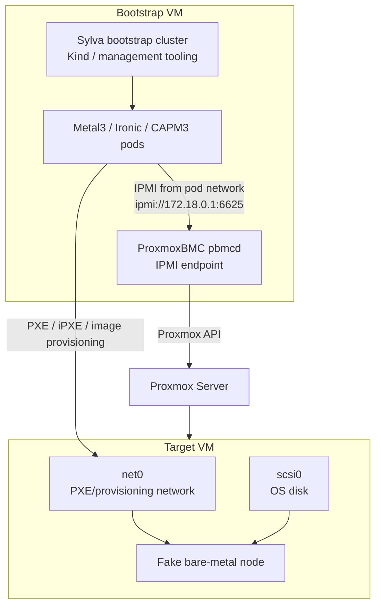

# ProxmoxBMC Option B Runbook

This runbook documents the full lab path for using a **Bootstrap VM on Proxmox** to control a separate **Proxmox target VM** through **ProxmoxBMC**, then letting Sylva/CAPM3/Metal3 treat that target VM like a fake bare-metal host.

Use this when you do not have a real physical BMC, but you want to practice the bare-metal CAPM3 flow.

## Final Lab Architecture



Important result from the lab:

```text
Bootstrap host IP: 10.237.71.153
Kind/Docker bridge IP reachable from Metal3 pods: 172.18.0.1
ProxmoxBMC port: 6625
Correct BMC address for Sylva/Metal3: ipmi://172.18.0.1:6625
```

Metal3 runs inside pods, so it must use the IP address reachable **from the pod network**, not necessarily the IP that works from the Bootstrap VM shell.

## Phase 0: IP Plan

Example used in this lab:

| Purpose | Example |
| --- | --- |
| Bare-metal network | `10.237.71.0/24` |
| Gateway | `10.237.71.254` |
| Bootstrap VM | `10.237.71.153` |
| Kind node bridge | `172.18.0.1` |
| Target VM IP pool | `10.237.71.68-10.237.71.80` |
| Cluster virtual IP | `10.237.71.140` |
| ProxmoxBMC IPMI port | `6625/udp` |

Rules:

- Node IPs and `cluster_virtual_ip` should be in the bare-metal network.
- `cluster_virtual_ip` must be free and outside the target node IP pool.
- The BMC address must be reachable from Metal3 pods.
- In this lab, Metal3 pods reach ProxmoxBMC at `172.18.0.1:6625`.

## Phase 1: Create the Bootstrap VM

Create an Ubuntu 22.04 VM on Proxmox.

Recommended:

| Component | Value |
| --- | --- |
| CPU | 4+ vCPU |
| RAM | 8 to 16 GB |
| Disk | 50+ GB |
| Network | Same lab network as Proxmox and target VM |
| IP | Static or reserved DHCP, for example `10.237.71.153` |

Install tools:

```bash
sudo apt update
sudo apt install -y \
  curl \
  git \
  jq \
  make \
  python3 \
  python3-pip \
  python3-venv \
  ca-certificates \
  ipmitool \
  yamllint
```

Install Docker:

```bash
sudo apt remove docker docker-engine docker.io containerd runc -y
sudo mkdir -p /etc/apt/keyrings

curl -fsSL https://download.docker.com/linux/ubuntu/gpg | \
sudo gpg --dearmor -o /etc/apt/keyrings/docker.gpg

echo \
"deb [arch=$(dpkg --print-architecture) \
signed-by=/etc/apt/keyrings/docker.gpg] \
https://download.docker.com/linux/ubuntu \
$(lsb_release -cs) stable" | \
sudo tee /etc/apt/sources.list.d/docker.list > /dev/null

sudo apt update
sudo apt install -y docker-ce docker-ce-cli containerd.io
sudo systemctl enable docker
sudo systemctl start docker
sudo usermod -aG docker $USER
newgrp docker
```

Verify:

```bash
docker ps
hostname -I
```

## Phase 2: Create the Proxmox Target VM

Create a separate VM on Proxmox. This is the node Metal3 will manage.

Example:

| Component | Value |
| --- | --- |
| Name | `fake-bm-01` |
| VMID | `109` |
| CPU | 4+ vCPU |
| RAM | 8+ GB |
| Disk | `scsi0`, 50+ GB |
| NIC | `net0` |
| MAC | Example `BC:24:11:8B:4D:7F` |
| Boot order | `net0` first, then `scsi0` |
| BIOS | Match `bootMode`: SeaBIOS for `legacy`, OVMF for `UEFI` |

For the current lab, use:

```text
Proxmox BIOS: SeaBIOS
Sylva/Metal3 bootMode: legacy
```

Do not manually install an OS on the target VM. Metal3 should provision the disk.

Record:

```text
Target VMID: 109
Target net0 MAC: BC:24:11:8B:4D:7F
Boot disk: scsi0
Boot NIC: net0
```

## Phase 3: Create Proxmox API Token

In Proxmox UI:

```text
Datacenter > Permissions > API Tokens
```

Create a token that can manage the target VM.

For a lab, example:

```text
PVE_HOST=10.237.71.<proxmox-ip>
PVE_TOKEN_USER=root@pam
PVE_TOKEN_NAME=bmc
PVE_TOKEN_ID=root@pam!bmc
PVE_TOKEN_SECRET=<token-secret>
TARGET_VMID=109
```

Required permissions should include:

- `VM.Audit`
- `VM.PowerMgmt`
- `VM.Config.Options`

Do not commit token secrets to Git.

Test Proxmox API access from the Bootstrap VM:

```bash
export PVE_HOST="<proxmox-hostname-or-ip>"
export PVE_NODE="<proxmox-node-name>"
export PVE_TOKEN_USER="<user@realm>"
export PVE_TOKEN_NAME="<token-name>"
export PVE_TOKEN_ID="<user@realm!token-name>"
export PVE_TOKEN_SECRET="<token-secret>"
export TARGET_VMID="109"

curl -k \
  -H "Authorization: PVEAPIToken=${PVE_TOKEN_ID}=${PVE_TOKEN_SECRET}" \
  "https://${PVE_HOST}:8006/api2/json/nodes/${PVE_NODE}/qemu/${TARGET_VMID}/status/current" | jq
```

## Phase 4: Install ProxmoxBMC

Run on the Bootstrap VM:

```bash
cd ~
git clone https://github.com/agnon/proxmoxbmc.git
cd proxmoxbmc

python3 -m venv .env
. .env/bin/activate
pip install -r requirements.txt
pip install .
```

Verify:

```bash
pbmc --help
pbmcd --help
```

Start `pbmcd` manually for first test:

```bash
cd ~/proxmoxbmc
. .env/bin/activate
pbmcd
```

Open a second terminal and add the target VM:

```bash
cd ~/proxmoxbmc
. .env/bin/activate

pbmc add \
  --username admin \
  --password password \
  --port 6625 \
  --address 0.0.0.0 \
  --proxmox-address "${PVE_HOST}" \
  --token-user "${PVE_TOKEN_USER}" \
  --token-name "${PVE_TOKEN_NAME}" \
  --token-value "${PVE_TOKEN_SECRET}" \
  "${TARGET_VMID}"

pbmc start "${TARGET_VMID}"
pbmc list
```

Expected:

```text
+------+---------+---------+------+
| VMID | Status  | Address | Port |
+------+---------+---------+------+
| 109  | running | 0.0.0.0 | 6625 |
+------+---------+---------+------+
```

Check listener:

```bash
sudo ss -lunp | grep 6625
```

Expected:

```text
0.0.0.0:6625
```

Test from Bootstrap VM:

```bash
ipmitool -I lanplus -H 10.237.71.153 -p 6625 -U admin -P password power status
```

## Phase 5: Install ProxmoxBMC as a Service

Create:

```bash
sudo vim /etc/systemd/system/pbmcd.service
```

Example:

```ini
[Unit]
Description=pbmcd service
After=network.target

[Service]
ExecStart=/home/oie/proxmoxbmc/.env/bin/pbmcd --foreground
Restart=on-failure
RestartSec=2
TimeoutSec=120
Type=simple
User=oie
Group=oie

[Install]
WantedBy=multi-user.target
```

Adjust paths and user if needed.

Enable:

```bash
sudo systemctl daemon-reload
sudo systemctl enable pbmcd
sudo systemctl start pbmcd
sudo systemctl status pbmcd
sudo journalctl -u pbmcd -n 50 --no-pager
```

## Phase 6: Find the Pod-Reachable BMC Address

This was the key discovery in the lab.

From the Bootstrap VM:

```bash
hostname -I
kubectl get nodes -o wide
```

Example:

```text
Bootstrap host IP: 10.237.71.153
Kind node IP: 172.18.0.2
Kind bridge/gateway IP: 172.18.0.1
```

Run a test pod:

```bash
kubectl run ipmi-test \
  -n sylva-system \
  --rm -it \
  --restart=Never \
  --image=ubuntu:22.04 \
  -- bash
```

Inside the pod:

```bash
apt update
apt install -y ipmitool iputils-ping netcat-openbsd
```

Test:

```bash
ping -c 3 10.237.71.153
nc -uvz 10.237.71.153 6625
ipmitool -I lanplus -H 10.237.71.153 -p 6625 -U admin -P password power status
```

In this lab, `10.237.71.153` was reachable for ping/UDP but IPMI session failed from the pod.

Test Docker/kind bridge IPs:

```bash
ipmitool -I lanplus -H 172.18.0.1 -p 6625 -U admin -P password power status
ipmitool -I lanplus -H 172.17.0.1 -p 6625 -U admin -P password power status
```

The working address was:

```text
ipmi://172.18.0.1:6625
```

Use that address in Sylva values, because Metal3 runs in pods.

## Phase 7: Clone Sylva Core

```bash
git clone https://gitlab.com/sylva-projects/sylva-core.git
cd sylva-core
```

Pin a tested release if required:

```bash
git tag --list
git checkout <tested-release>
```

Copy CAPM3 values:

```bash
cp -r environment-values/rke2-capm3 environment-values/my-rke2-capm3
```

## Phase 8: Configure values.yaml

Example single-node CAPM3 lab values:

```yaml
cluster_virtual_ip: 10.237.71.140

cluster:
  capi_providers:
    infra_provider: capm3
    bootstrap_provider: cabpr

  control_plane_replicas: 1

  enable_longhorn: false

  rke2:
    additionalUserData:
      config:
        #cloud-config
        users:
          - name: sylva-user
            groups: users,sylva-ops
            sudo: ALL=(ALL) NOPASSWD:ALL
            shell: /bin/bash
            lock_passwd: false
            passwd: "<hashed-password>"
            ssh_authorized_keys:
              - "<your-ssh-public-key>"

  capm3:
    os_image_selector:
      os: ubuntu
      hardened: true
    networks:
      primary:
        subnet: 10.237.71.0/24
        gateway: 10.237.71.254
        start: 10.237.71.68
        end: 10.237.71.80
    dns_servers:
      - 10.237.25.2
      - 8.8.8.8

  control_plane:
    capm3:
      hostSelector:
        matchLabels:
          cluster-role: control-plane
          host-type: generic
      networks:
        primary:
          interface: ens18
    network_interfaces:
      ens18:
        type: phy

  machine_deployment_default:
    capm3:
      hostSelector:
        matchLabels:
          cluster-role: worker
          host-type: generic
      networks:
        primary:
          interface: ens18

  machine_deployments: {}

  baremetal_host_default:
    bmh_spec:
      externallyProvisioned: false
      bmc:
        disableCertificateVerification: true
      bootMode: legacy
      rootDeviceHints:
        deviceName: /dev/sda

  baremetal_hosts:
    my-server:
      bmh_metadata:
        labels:
          cluster-role: control-plane
          host-type: generic
      bmh_spec:
        description: my fake baremetal node on Proxmox
        bmc:
          address: ipmi://172.18.0.1:6625
          disableCertificateVerification: true
        bootMACAddress: "BC:24:11:8B:4D:7F"
        bootMode: legacy
        rootDeviceHints:
          deviceName: /dev/sda

metal3:
  bootstrap_ip: 10.237.71.153

proxies:
  http_proxy: ""
  https_proxy: ""
  no_proxy: ""

ntp:
  enabled: false
  servers: []
```

Important notes:

- `bmc.address` must be the pod-reachable address: `ipmi://172.18.0.1:6625`.
- `bootMACAddress` must match target VM `net0`.
- `bootMode` must match Proxmox BIOS:
  - `legacy` for SeaBIOS
  - `UEFI` for OVMF
- `host-type: generic` is required because CAPM3 searched for it.
- Disable Longhorn first with `enable_longhorn: false`; add storage later after the cluster is healthy.
- Keep `cluster_virtual_ip` free and outside the node IP pool.

## Phase 9: Configure secrets.yaml

Example:

```yaml
cluster:
  baremetal_hosts:
    my-server:
      credentials:
        username: admin
        password: "password"
```

This must match ProxmoxBMC:

```bash
pbmc add --username admin --password password ...
```

Do not commit real secrets.

## Phase 10: Apply Sylva

Validate:

```bash
yamllint environment-values/my-rke2-capm3/values.yaml
yamllint environment-values/my-rke2-capm3/secrets.yaml
```

Apply using the command supported by your Sylva release:

```bash
make all ENV=environment-values/my-rke2-capm3
```

or:

```bash
./apply.sh environment-values/my-rke2-capm3
```

## Phase 11: Watch Bootstrap Resources

```bash
kubectl get kustomizations -n sylva-system
kubectl get helmreleases -n sylva-system
kubectl get pods -A
```

Metal3 and image server should become ready.

## Phase 12: Validate BareMetalHost Registration

Check host:

```bash
kubectl get baremetalhosts -A --show-labels
kubectl describe baremetalhost management-cluster-my-server -n sylva-system
```

Expected progress:

```text
registering -> inspecting -> available -> provisioning -> provisioned
```

If stuck at `registration error` with:

```text
IPMI call failed: power status
```

check:

```bash
kubectl describe baremetalhost management-cluster-my-server -n sylva-system | grep -A8 Bmc
kubectl get secret management-cluster-my-server-secret -n sylva-system -o jsonpath='{.data.username}' | base64 -d
kubectl get secret management-cluster-my-server-secret -n sylva-system -o jsonpath='{.data.password}' | base64 -d
```

Then test from pod:

```bash
kubectl run ipmi-test \
  -n sylva-system \
  --rm -it \
  --restart=Never \
  --image=ubuntu:22.04 \
  -- bash

apt update
apt install -y ipmitool
ipmitool -I lanplus -H 172.18.0.1 -p 6625 -U admin -P password power status
```

## Phase 13: Debug Host Selection

If CAPM3 logs show:

```text
hostcount=0
No available host found
```

check:

```bash
kubectl get baremetalhosts -A --show-labels
```

The host must have:

```text
cluster-role=control-plane
host-type=generic
```

and must be `available`.

If labels are missing:

```bash
kubectl label baremetalhost management-cluster-my-server \
  -n sylva-system \
  cluster-role=control-plane \
  host-type=generic \
  --overwrite
```

If the host is `inspecting`, wait for inspection or check PXE.

## Phase 14: Debug Inspection

If BMH shows:

```text
State: inspecting
Operational Status: OK
Powered On: false
```

test power through the same address Metal3 uses:

```bash
ipmitool -I lanplus -H 172.18.0.1 -p 6625 -U admin -P password power status
ipmitool -I lanplus -H 172.18.0.1 -p 6625 -U admin -P password power on
```

Open Proxmox target VM console.

For legacy boot, target VM should show PXE/iPXE boot from `net0`.

Check:

```text
Proxmox BIOS: SeaBIOS
BMH bootMode: legacy
Boot order: net0 first
MAC: same as bootMACAddress
```

For UEFI:

```text
Proxmox BIOS: OVMF
EFI disk exists
BMH bootMode: UEFI
Boot order: net0 first
```

Logs:

```bash
kubectl logs -n baremetal-operator-system deployment/baremetal-operator-controller-manager --tail=200
kubectl logs -n metal3-system deployment/metal3-ironic --tail=200
sudo journalctl -u pbmcd -f
```

## Phase 15: Debug OS Image Stage

This stage starts after inspection succeeds and provisioning begins.

Your values use:

```yaml
cluster:
  capm3:
    os_image_selector:
      os: ubuntu
      hardened: true
```

Sylva should serve the selected image through `os-image-server`.

Check:

```bash
kubectl get helmrelease os-image-server -n sylva-system
kubectl get kustomization os-image-server -n sylva-system
kubectl logs -n sylva-system deploy/os-image-server --tail=100
```

If you see image errors, check selector compatibility with your Sylva release:

```yaml
os: ubuntu
hardened: true
```

or try:

```yaml
os: ubuntu
hardened: false
```

Do not debug OS images until the BMH reaches provisioning.

## Phase 16: Debug Cluster API Reachability

If you see:

```text
cluster is not reachable
Get "https://<ip>:6443"
```

first check whether the host was provisioned:

```bash
kubectl get baremetalhosts -A
kubectl get machines -A -o wide
kubectl get rke2controlplanes -A
```

Then check the endpoint:

```bash
kubectl get cluster management-cluster -n sylva-system -o yaml | grep -A8 controlPlaneEndpoint
```

If possible, SSH to the target node and check:

```bash
sudo systemctl status rke2-server
sudo journalctl -u rke2-server -n 100 --no-pager
sudo cloud-init status --long
sudo ss -lntp | grep 6443
ip a
```

## Phase 17: Storage and Longhorn

Do not debug Longhorn until the cluster is healthy.

For a one-node fake lab, start with:

```yaml
cluster:
  enable_longhorn: false
```

Longhorn should not use the OS disk. If you want Longhorn later, add a second Proxmox disk:

```text
scsi0 = OS disk
scsi1 = Longhorn disk
```

Then configure Longhorn after the node is provisioned.

## Phase 18: O-DU and O-CU

Deploy O-DU/O-CU only after:

```bash
kubectl get nodes
kubectl get pods -A
kubectl get sylvaunits -A
```

show a healthy cluster.

Then follow the main README O-RAN workload steps.

## Quick Troubleshooting Matrix

| Symptom | Meaning | Fix |
| --- | --- | --- |
| `IPMI call failed: power status` | Metal3 cannot talk to BMC | Use `ipmi://172.18.0.1:6625`, verify secret, test from pod |
| `hostcount=0` | No available matching BMH | Check labels and BMH state |
| BMH `registering` with error | BMC access broken | Fix ProxmoxBMC address/port/credentials |
| BMH `inspecting`, powered off | Inspection started but VM not booting | Power on via IPMI, check Proxmox console |
| PXE timeout | Provisioning network problem | Check `net0`, DHCP, Metal3/Ironic services |
| `cluster unreachable :6443` | RKE2 API not ready | Check machine provisioning, VIP, RKE2 service |
| Longhorn errors | Storage stage | Disable Longhorn until cluster works |

