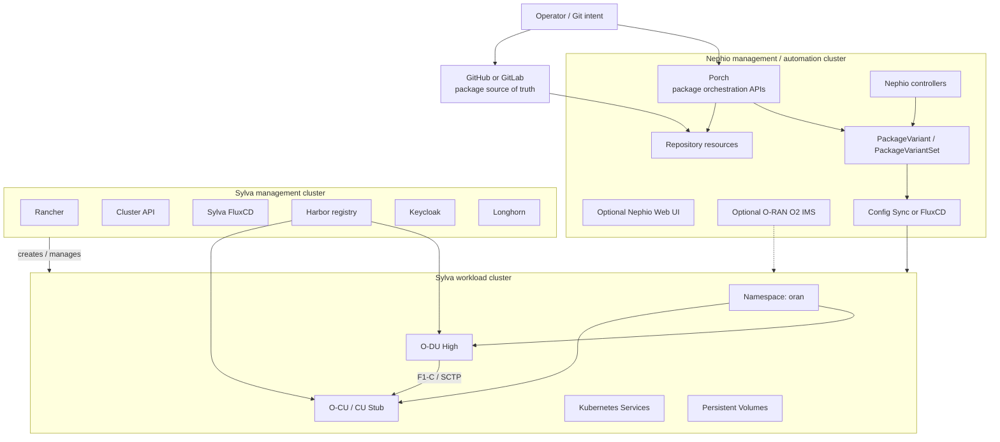

# Nephio Integration with Sylva OIE

## Purpose

This guide adds Nephio to the Sylva OIE project as an intent-driven automation layer for deploying and managing O-RAN workloads, especially O-CU and O-DU packages, on top of Sylva-managed Kubernetes clusters.

Nephio does not replace Sylva in this architecture. Sylva builds and operates the telco cloud platform. Nephio sits above it and manages network function packages, package variants, Git repositories, and workload placement.

## Recommended Workflow


## Architecture



## Deployment Options

### Option A - Separate Nephio Management Cluster

Use this for the cleanest architecture.

- Sylva management cluster: builds and manages telco Kubernetes infrastructure.
- Sylva workload cluster: runs O-CU/O-DU workloads.
- Nephio management cluster: manages Git packages, package variants, and deployment intent.

This avoids mixing Nephio controllers with the Sylva management plane. It also makes the architecture easier to explain in a project report.

### Option B - Nephio on the Sylva Management Cluster

Use this only for a small lab if hardware is limited.

- Deploy Sylva first.
- Wait until Sylva management cluster is healthy.
- Install Nephio components into separate namespaces on the same management cluster.
- Keep O-CU and O-DU workloads on the Sylva workload cluster, not on the management cluster.

This is simpler to run but heavier on the same cluster. If Sylva units are still reconciling or Longhorn is not healthy, do not add Nephio yet.

## Prerequisites

### Infrastructure

- A working Sylva management cluster.
- A reachable Sylva workload cluster.
- A bootstrap/admin machine with `kubectl` access to both clusters.
- Docker installed on the Nephio install host when using the official Nephio install scripts.
- GitHub, GitLab, or Gitea repository access for Nephio packages.
- Container registry access, preferably Sylva Harbor or another reachable registry.

### Tools

Install these on the admin machine or Nephio VM:

```bash
sudo apt update
sudo apt install -y git curl wget jq make docker.io
sudo systemctl enable --now docker
sudo usermod -aG docker $USER
newgrp docker
```

Install `kubectl`:

```bash
curl -LO "https://dl.k8s.io/release/$(curl -L -s https://dl.k8s.io/release/stable.txt)/bin/linux/amd64/kubectl"
chmod +x kubectl
sudo mv kubectl /usr/local/bin/
kubectl version --client
```

Install `kpt` because Nephio catalog packages use `kpt pkg get`, `kpt fn render`, and `kpt live apply`:

```bash
curl -L https://github.com/kptdev/kpt/releases/latest/download/kpt_linux_amd64 -o kpt
chmod +x kpt
sudo mv kpt /usr/local/bin/
kpt version
```

## Step 1 - Verify Sylva First

Run these from the bootstrap/admin machine using the Sylva management kubeconfig:

```bash
kubectl get nodes -o wide
kubectl get pods -A
kubectl get sylvaunits -A
kubectl get clusters -A
```

If you are using the validated ProxmoxBMC CAPM3 lab, also check:

```bash
kubectl get baremetalhosts -A
kubectl get machines -A
kubectl get nodes.longhorn.io -n longhorn-system
```

Do not install Nephio while Sylva is stuck in `cluster-reachable`, `cluster-machines-ready`, inspection, provisioning, or Longhorn disk errors. Fix Sylva first.

## Step 2 - Choose the Nephio Target Cluster

Set two kubeconfig variables:

```bash
export NEPHIO_KUBECONFIG=/path/to/nephio-management.kubeconfig
export SYLVA_WORKLOAD_KUBECONFIG=/path/to/sylva-workload.kubeconfig
```

For Option A, `NEPHIO_KUBECONFIG` points to a separate Nephio cluster.

For Option B, `NEPHIO_KUBECONFIG` can point to the Sylva management cluster, but only after Sylva is healthy.

Verify the Nephio target:

```bash
export KUBECONFIG=$NEPHIO_KUBECONFIG
kubectl get nodes
```

Verify the Sylva workload cluster:

```bash
export KUBECONFIG=$SYLVA_WORKLOAD_KUBECONFIG
kubectl get nodes
kubectl create namespace oran --dry-run=client -o yaml | kubectl apply -f -
```

## Step 3 - Install Nephio Base Components

Use the official Nephio release branch or tag for your project. The examples below use `origin/main`; for a fixed release, replace it with a tag such as `v4.0.0` if that is the release you selected.

```bash
export KUBECONFIG=$NEPHIO_KUBECONFIG
export NEPHIO_REF=origin/main
```

Install Porch:

```bash
kpt pkg get --for-deployment https://github.com/nephio-project/catalog.git/nephio/core/porch@$NEPHIO_REF
kpt fn render porch
kpt live init porch
kpt live apply porch --reconcile-timeout=15m --output=table
```

Install Nephio operators:

```bash
kpt pkg get --for-deployment https://github.com/nephio-project/catalog.git/nephio/core/nephio-operator@$NEPHIO_REF
```

Before applying the operator package, update the Git repository references inside:

```bash
grep -R "gitea\\|github\\|gitlab\\|172.18.0.200" -n nephio-operator
```

Create Git credentials for Nephio:

```bash
kubectl create namespace nephio-system --dry-run=client -o yaml | kubectl apply -f -

kubectl create secret generic git-user-secret \
  -n nephio-system \
  --type=kubernetes.io/basic-auth \
  --from-literal=username="<GIT_USERNAME>" \
  --from-literal=password="<GIT_TOKEN_OR_PASSWORD>" \
  --dry-run=client -o yaml | kubectl apply -f -
```

Apply the operator package:

```bash
kpt fn render nephio-operator
kpt live init nephio-operator
kpt live apply nephio-operator --reconcile-timeout=15m --output=table
```

Install the management cluster GitOps tool used by Nephio:

```bash
kpt pkg get --for-deployment https://github.com/nephio-project/catalog.git/nephio/core/configsync@$NEPHIO_REF
kpt fn render configsync
kpt live init configsync
kpt live apply configsync --reconcile-timeout=15m --output=table
```

Optionally install stock repositories:

```bash
kpt pkg get --for-deployment https://github.com/nephio-project/catalog.git/nephio/optional/stock-repos@$NEPHIO_REF
kpt fn render stock-repos
kpt live init stock-repos
kpt live apply stock-repos --reconcile-timeout=15m --output=table
```

## Step 4 - Optional Nephio Components

Install the Web UI if you need a visual interface:

```bash
kpt pkg get --for-deployment https://github.com/nephio-project/catalog.git/nephio/optional/webui@$NEPHIO_REF
kpt fn render webui
kpt live init webui
kpt live apply webui --reconcile-timeout=15m --output=table
```

Forward the Web UI:

```bash
kubectl port-forward --namespace=nephio-webui svc/nephio-webui 7007:7007
```

Open:

```text
http://localhost:7007/config-as-data
```

Install O2 IMS only if the project needs O-RAN O-Cloud inventory or O2 interface demonstrations:

```bash
kpt pkg get --for-deployment https://github.com/nephio-project/catalog.git/nephio/optional/o2ims@$NEPHIO_REF
kpt fn render o2ims
kpt live init o2ims
kpt live apply o2ims --reconcile-timeout=15m --output=table
```

## Step 5 - Create the O-CU/O-DU Package Repository

Create a Git repository for your O-RAN packages, for example:

```text
Sylva_OIE_Project
+-- nephio-packages
    +-- o-ran
        +-- o-cu
        |   +-- Kptfile
        |   +-- namespace.yaml
        |   +-- deployment.yaml
        |   +-- service.yaml
        |   +-- configmap.yaml
        +-- o-du
            +-- Kptfile
            +-- namespace.yaml
            +-- deployment.yaml
            +-- service.yaml
            +-- configmap.yaml
```

Minimum O-CU package example:

```yaml
apiVersion: apps/v1
kind: Deployment
metadata:
  name: o-cu
  namespace: oran
spec:
  replicas: 1
  selector:
    matchLabels:
      app: o-cu
  template:
    metadata:
      labels:
        app: o-cu
    spec:
      containers:
        - name: o-cu
          image: harbor.example.local/oran/o-cu:lab
          ports:
            - containerPort: 38472
              protocol: SCTP
```

Minimum O-DU package example:

```yaml
apiVersion: apps/v1
kind: Deployment
metadata:
  name: o-du
  namespace: oran
spec:
  replicas: 1
  selector:
    matchLabels:
      app: o-du
  template:
    metadata:
      labels:
        app: o-du
    spec:
      containers:
        - name: o-du
          image: harbor.example.local/oran/o-du:lab
          env:
            - name: OCU_F1_ADDRESS
              value: o-cu.oran.svc.cluster.local
```

Replace `harbor.example.local` with your real Sylva Harbor registry or another registry reachable from the workload cluster.

## Step 6 - Register Package Repositories in Nephio

Repository resources are handled by Porch. Create repository definitions for:

- A blueprint/package repository containing reusable O-CU and O-DU packages.
- A deployment repository representing the target site or lab cluster.

Example skeleton:

```yaml
apiVersion: config.porch.kpt.dev/v1alpha1
kind: Repository
metadata:
  name: sylva-oie-packages
  namespace: default
spec:
  type: git
  content: Package
  git:
    repo: https://github.com/mohammedelnageb/Sylva_OIE_Project.git
    branch: main
    directory: nephio-packages
```

Apply it:

```bash
export KUBECONFIG=$NEPHIO_KUBECONFIG
kubectl apply -f repository-sylva-oie-packages.yaml
kubectl get repositories -A
kubectl get packagerevisions -A
```

## Step 7 - Register the Sylva Workload Cluster

The exact workload-cluster registration method depends on the Nephio release and GitOps tool selected. The target result is:

- Nephio knows the Sylva workload cluster as a deployment target.
- The workload cluster has a GitOps agent or reconciler.
- The workload cluster can pull O-CU/O-DU images from the selected registry.

Validation commands:

```bash
export KUBECONFIG=$SYLVA_WORKLOAD_KUBECONFIG
kubectl get nodes -o wide
kubectl get ns oran
kubectl auth can-i create deployments -n oran
kubectl auth can-i create services -n oran
```

If using Flux on the Sylva workload cluster, keep Sylva platform Flux resources separate from Nephio workload resources. Use a dedicated namespace and Git path for Nephio-managed O-RAN packages.

## Step 8 - Deploy O-CU and O-DU Through Nephio

Create package variants for the lab site. The package variant should take the reusable O-CU/O-DU package and produce a site-specific deployment package.

Example intent:

```yaml
apiVersion: config.porch.kpt.dev/v1alpha1
kind: PackageVariant
metadata:
  name: o-du-lab-site
  namespace: default
spec:
  upstream:
    repo: sylva-oie-packages
    package: o-ran/o-du
    revision: main
  downstream:
    repo: sylva-oie-deployments
    package: sites/lab-01/o-du
  annotations:
    approval.nephio.org/policy: initial
```

Then check generated packages:

```bash
export KUBECONFIG=$NEPHIO_KUBECONFIG
kubectl get packagevariants -A
kubectl get packagerevisions -A
```

After the deployment repository reconciles to the Sylva workload cluster:

```bash
export KUBECONFIG=$SYLVA_WORKLOAD_KUBECONFIG
kubectl get pods -n oran -o wide
kubectl get svc -n oran
kubectl logs -n oran deploy/o-cu --tail=100
kubectl logs -n oran deploy/o-du --tail=100
```

## Step 9 - Validation Checklist

The Nephio integration is working when:

- Porch is running and repository resources are visible.
- Nephio operators are running without crash loops.
- The O-CU/O-DU package repository is registered.
- Package variants generate deployment packages.
- The Sylva workload cluster receives the final manifests.
- O-CU and O-DU pods are running in namespace `oran`.
- O-DU logs show it can resolve or connect to the O-CU service.
- Sylva monitoring can observe the workload pods.

Useful commands:

```bash
export KUBECONFIG=$NEPHIO_KUBECONFIG
kubectl get pods -A | grep -Ei 'nephio|porch|configsync|gitea'
kubectl get repositories -A
kubectl get packagerevisions -A
kubectl get packagevariants -A

export KUBECONFIG=$SYLVA_WORKLOAD_KUBECONFIG
kubectl get pods -n oran -o wide
kubectl describe pod -n oran -l app=o-du
kubectl describe pod -n oran -l app=o-cu
```

## Troubleshooting

| Problem | Likely Cause | Fix |
| --- | --- | --- |
| `kpt live apply` fails | Wrong kubeconfig context | Run `kubectl config current-context` and set `KUBECONFIG=$NEPHIO_KUBECONFIG`. |
| Nephio packages fail to pull | Git credentials or repository URL is wrong | Recreate `git-user-secret` and verify Git URL access. |
| `repositories` or `packagerevisions` are missing | Porch is not installed or CRDs are not ready | Check Porch pods and re-run the Porch install. |
| O-CU/O-DU packages are created but not applied | Workload cluster GitOps is not connected | Check Flux/Config Sync on the workload cluster. |
| Pods stay `ImagePullBackOff` | Workload cluster cannot pull from Harbor/registry | Check image path, registry credentials, CA trust, and proxy settings. |
| Pods stay `Pending` | Not enough CPU/RAM/storage | Check node capacity, PVCs, Longhorn health, and resource requests. |
| Nephio conflicts with Sylva Flux | Same Git path or namespace used by both systems | Separate Sylva platform paths from Nephio workload paths. |
| Web UI not reachable | Port-forward not running or wrong namespace | Re-run `kubectl port-forward -n nephio-webui svc/nephio-webui 7007:7007`. |

## Lab Reporting Notes

For the final project report, describe Nephio like this:

```text
Nephio was introduced as an intent-driven package orchestration layer above Sylva.
Sylva provides the telco cloud platform and Kubernetes cluster lifecycle, while
Nephio manages O-RAN workload packages and site-specific deployment variants for
O-CU and O-DU onboarding.
```

This makes the project architecture:

```text
Infrastructure / Proxmox or VMware
        |
        v
Sylva management cluster
        |
        v
Sylva workload cluster
        |
        v
O-CU and O-DU CNFs

Nephio sits beside/above this path and controls the workload package lifecycle
through Git and Kubernetes Resource Model packages.
```

## References

- Nephio documentation: https://docs.nephio.org/docs/
- Nephio installation guides: https://docs.nephio.org/docs/guides/install-guides/
- Nephio base components: https://docs.nephio.org/docs/guides/install-guides/common-components/
- Nephio common dependencies: https://docs.nephio.org/docs/guides/install-guides/common-dependencies/
- Porch documentation: https://docs.nephio.org/docs/porch/
- Sylva Core repository: https://gitlab.com/sylva-projects/sylva-core
