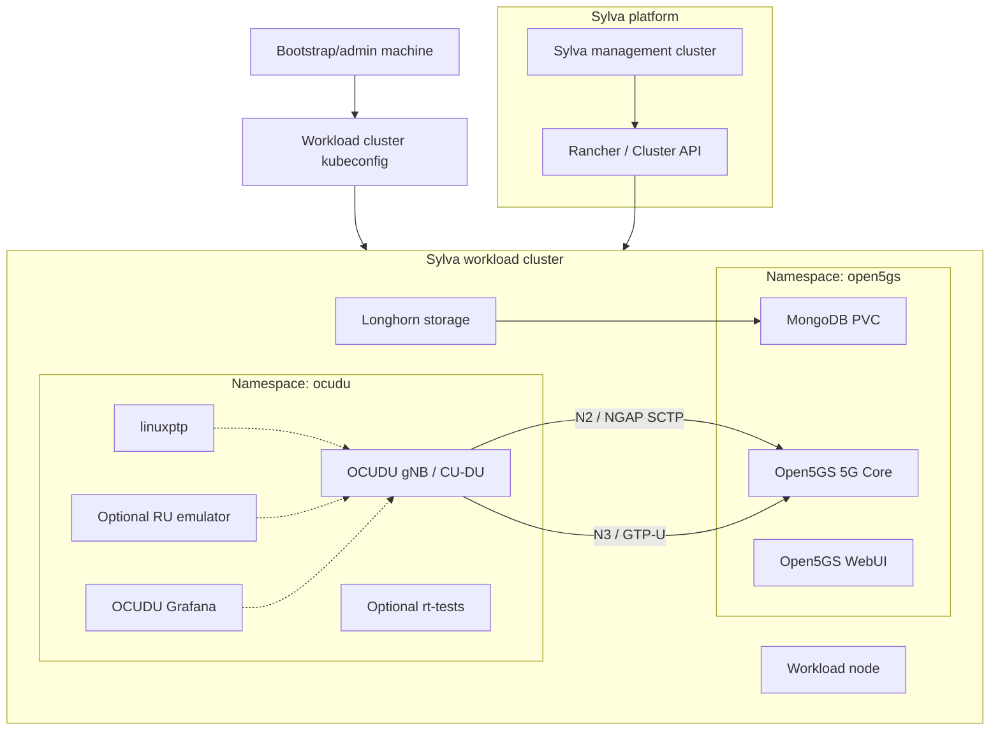

# OCUDU O-CU/O-DU Deployment on Sylva Workload Cluster

## Purpose

This guide completes the Sylva OIE lab by deploying an OCUDU-based RAN workload on the Sylva workload cluster.

It adapts the official OCUDU Kubernetes tutorial to this project. The OCUDU tutorial uses a single-node Kubernetes/K3s example, but in this project the Kubernetes cluster is already created by Sylva. Therefore, do not install K3s again. Use the Sylva workload cluster kubeconfig and deploy the RAN components there.

## Target Architecture



## Deployment Workflow

```mermaid
flowchart LR
    a["Verify workload cluster"] --> b["Prepare node kernel/modules"]
    b --> c["Install Helm repo"]
    c --> d["Optional: deploy PTP"]
    d --> e["Deploy Open5GS"]
    e --> f["Configure subscribers"]
    f --> g["Prepare OCUDU values.yaml"]
    g --> h["Deploy OCUDU gNB / CU-DU"]
    h --> i["Validate pods and services"]
    i --> j["Optional: deploy RU emulator / rt-tests / Grafana"]
```



## Important Notes for This Lab

- The official OCUDU tutorial starts by deploying K3s. Skip that part because Sylva already created the workload cluster.
- Run all Kubernetes and Helm commands with the workload cluster kubeconfig.
- For a first lab deployment, use internal Kubernetes DNS for Open5GS services.
- For real O-RAN split 7.2 with RU hardware, you will need correct PTP, NIC, VLAN, DPDK, and possibly privileged/hostNetwork settings.
- If PodSecurity blocks privileged pods, you must relax the namespace policy or create a controlled privileged namespace for OCUDU.

## Step 1 - Select the Workload Cluster

On the bootstrap/admin machine:

```bash
export KUBECONFIG=/path/to/workload-cluster.kubeconfig

kubectl get nodes -o wide
kubectl get pods -A
```

Create the namespaces:

```bash
kubectl create namespace ocudu --dry-run=client -o yaml | kubectl apply -f -
kubectl create namespace open5gs --dry-run=client -o yaml | kubectl apply -f -
```

If the cluster enforces restricted PodSecurity and you need host networking, privileged mode, or DPDK access, label the OCUDU namespace:

```bash
kubectl label namespace ocudu \
  pod-security.kubernetes.io/enforce=privileged \
  pod-security.kubernetes.io/audit=privileged \
  pod-security.kubernetes.io/warn=privileged \
  --overwrite
```

## Step 2 - Prepare the Workload Node

SSH to the workload node:

```bash
ssh -i ~/.ssh/sylva-key sylva-user@<workload-node-ip>
```

Load SCTP because NGAP and F1 commonly use SCTP:

```bash
sudo modprobe sctp
sudo modprobe nf_conntrack_proto_sctp || true
lsmod | grep sctp
```

Persist after reboot:

```bash
echo sctp | sudo tee /etc/modules-load.d/sctp.conf
echo nf_conntrack_proto_sctp | sudo tee -a /etc/modules-load.d/sctp.conf
```

Optional for performance labs:

```bash
sudo apt update
sudo apt install -y linux-tools-common linux-tools-generic tuned
sudo systemctl enable --now tuned
```

If you need DPDK or a real RU, prepare the NICs according to your hardware design before deploying OCUDU.

## Step 3 - Install Helm and Add Repositories

On the bootstrap/admin machine:

```bash
helm version
```

If Helm is missing:

```bash
curl https://raw.githubusercontent.com/helm/helm/main/scripts/get-helm-3 | bash
```

Add the OCUDU Helm repository:

```bash
helm repo add ocudu https://gitlab.com/ocudu/ocudu_elements/ocudu_helm/
helm repo update
```

## Step 4 - Optional PTP Synchronization

For basic Kubernetes smoke testing, you can skip PTP.

For split 7.2 with RU hardware, deploy linuxptp. Create:

```bash
mkdir -p ocudu-values
nano ocudu-values/linuxptp-values.yaml
```

Example LLS-C1 configuration, where the DU side acts as PTP grandmaster:

```yaml
config:
  dataset_comparison: "G.8275.x"
  G.8275.defaultDS.localPriority: "128"
  maxStepsRemoved: "255"
  logAnnounceInterval: "-3"
  logSyncInterval: "-4"
  logMinDelayReqInterval: "-4"
  serverOnly: "1"
  clientOnly: "0"
  G.8275.portDS.localPriority: "128"
  ptp_dst_mac: "01:80:C2:00:00:0E"
  network_transport: "L2"
  domainNumber: "24"
resources:
  requests:
    cpu: "1"
    memory: "512Mi"
  limits:
    cpu: "1"
    memory: "512Mi"
```

Deploy:

```bash
helm install linuxptp ocudu/linuxptp \
  -n ocudu \
  -f ocudu-values/linuxptp-values.yaml

kubectl get pods -n ocudu
kubectl logs -n ocudu -l app.kubernetes.io/instance=linuxptp --tail=100
```

For LLS-C3, set `serverOnly: "0"` and `clientOnly: "1"` and point the node/RU to the common grandmaster.

## Step 5 - Deploy Open5GS Core

For Sylva, prefer Longhorn dynamic storage instead of a manual hostPath PV.

Check the default storage class:

```bash
kubectl get storageclass
```

Create an Open5GS values file:

```bash
nano ocudu-values/open5gs-values.yaml
```

Start with this skeleton and adjust PLMN/TAC/APN to match your OCUDU gNB config:

```yaml
mongodb:
  persistence:
    enabled: true
    storageClass: longhorn
    size: 8Gi

webui:
  enabled: true

amf:
  ngap:
    enabled: true
    service:
      type: ClusterIP

upf:
  gtpu:
    enabled: true
    service:
      type: ClusterIP
```

If your default storage class is already Longhorn and the chart does not accept `storageClass` under this exact key, check the chart values and place the storage class under the chart's MongoDB persistence settings.

Deploy Open5GS:

```bash
helm install open5gs oci://registry-1.docker.io/gradiant/open5gs \
  --version 2.2.5 \
  -n open5gs \
  --create-namespace \
  -f ocudu-values/open5gs-values.yaml
```

Wait:

```bash
kubectl get pods -n open5gs -w
```

Check services:

```bash
kubectl get svc -n open5gs
```

The AMF NGAP service will be used by OCUDU. Find it:

```bash
kubectl get svc -n open5gs | grep -Ei 'amf|ngap'
```

Access Open5GS WebUI:

```bash
kubectl port-forward svc/open5gs-webui 9999:9999 -n open5gs
```

Open:

```text
http://localhost:9999
```

Default credentials from the OCUDU tutorial:

```text
admin / 1423
```

Add your UE subscriber IMSI, key, OPC, APN, and slice values according to your UE/RU test setup.

## Step 6 - Discover Cluster DNS Domain

The OCUDU tutorial uses internal Kubernetes service names when Open5GS and OCUDU run in the same cluster.

Run:

```bash
kubectl run -it --image=ubuntu --restart=Never shell -- \
  sh -c 'apt-get update > /dev/null && apt-get install -y dnsutils > /dev/null && nslookup kubernetes.default | grep Name | sed "s/Name:[[:space:]]*kubernetes.default//"'
```

Example output:

```text
.svc.cluster.local
```

Delete the temporary pod:

```bash
kubectl delete pod shell
```

Build the AMF hostname:

```text
<amf-service-name>.open5gs.svc.cluster.local
```

Example:

```text
open5gs-amf-ngap.open5gs.svc.cluster.local
```

## Step 7 - Prepare OCUDU gNB/CU-DU Values

Download the default chart values if available:

```bash
helm show values ocudu/ocudu > ocudu-values/ocudu-gnb-values.yaml
```

If the chart name is different in the repository, list charts:

```bash
helm search repo ocudu
```

Then inspect the correct chart:

```bash
helm show values ocudu/<chart-name> > ocudu-values/ocudu-gnb-values.yaml
```

Edit the values:

```bash
nano ocudu-values/ocudu-gnb-values.yaml
```

Set these items based on your lab:

```yaml
amf:
  addr: open5gs-amf-ngap.open5gs.svc.cluster.local
  port: 38412

network:
  hostNetwork: true

securityContext:
  privileged: true
  capabilities:
    add:
      - SYS_NICE
      - NET_ADMIN

sriovConfig:
  enabled: false
```

For a first smoke test without RU/DPDK, keep the configuration simple. For real RU access, set the correct physical interface, VLAN tag, RU MAC, DU MAC, bandwidth, and compression settings required by your OCUDU release.

## Step 8 - Deploy OCUDU

Find the chart name:

```bash
helm search repo ocudu
```

Deploy using the chart name from your repository output. If the chart is named `ocudu`, run:

```bash
helm install ocudu-gnb ocudu/ocudu \
  -n ocudu \
  --create-namespace \
  -f ocudu-values/ocudu-gnb-values.yaml
```

If `helm search repo ocudu` shows a different chart name, replace `ocudu/ocudu` with that chart.

Watch pods:

```bash
kubectl get pods -n ocudu -w
```

Check logs:

```bash
kubectl logs -n ocudu -l app.kubernetes.io/instance=ocudu-gnb --tail=200
```

Check services:

```bash
kubectl get svc -n ocudu
kubectl get svc -n open5gs
```

## Step 9 - Optional RU Emulator

Use the RU emulator only if you are testing load without a physical RU.

Create:

```bash
nano ocudu-values/ru-emulator-values.yaml
```

Example:

```yaml
ru_emu:
  cells:
    - bandwidth: 100
      network_interface: <ofh-interface>
      ru_mac_addr: <ru-mac>
      du_mac_addr: <du-mac>
      vlan_tag: 6
      ul_port_id: [0]
      compr_method_ul: "bfp"
      compr_bitwidth_ul: 9

securityContext:
  privileged: true
  capabilities:
    add:
      - SYS_NICE
      - NET_ADMIN

sriovConfig:
  enabled: false
```

Deploy with the chart name shown by `helm search repo ocudu`:

```bash
helm install ocudu-ru-emulator ocudu/<ru-emulator-chart-name> \
  -n ocudu \
  -f ocudu-values/ru-emulator-values.yaml
```

Check logs:

```bash
kubectl logs -n ocudu -l app.kubernetes.io/instance=ocudu-ru-emulator --tail=200
```

## Step 10 - Optional Latency Test

Deploy OCUDU rt-tests:

```bash
nano ocudu-values/rt-tests-values.yaml
```

Example:

```yaml
config:
  rt_tests.yml: |-
    stress-ng: "--matrix 0 -t 12h"
    cyclictest: "-m -p95 -d0 -a 1-15 -t 16 -h400 -D 12h"
```

Deploy:

```bash
helm install rt-tests ocudu/rt-tests \
  -n ocudu \
  --create-namespace \
  -f ocudu-values/rt-tests-values.yaml
```

Logs:

```bash
kubectl logs -n ocudu -l app.kubernetes.io/instance=rt-tests --tail=200
```

## Step 11 - Optional Grafana Dashboard

Download chart values:

```bash
helm show values ocudu/grafana-deployment > ocudu-values/grafana-values.yaml
```

Edit the cluster domain and metrics WebSocket URL:

```bash
nano ocudu-values/grafana-values.yaml
```

Deploy:

```bash
helm install ocudu-grafana ocudu/grafana-deployment \
  -f ocudu-values/grafana-values.yaml \
  -n ocudu \
  --create-namespace
```

Forward Grafana:

```bash
export POD_NAME=$(kubectl get pods --namespace ocudu \
  -l "app.kubernetes.io/name=grafana,app.kubernetes.io/instance=ocudu-grafana" \
  -o jsonpath="{.items[0].metadata.name}")

kubectl --namespace ocudu port-forward $POD_NAME 3000
```

Open:

```text
http://localhost:3000
```

## Step 12 - Validation

Run:

```bash
kubectl get nodes -o wide
kubectl get pods -n open5gs -o wide
kubectl get pods -n ocudu -o wide
kubectl get svc -n open5gs
kubectl get svc -n ocudu
```

Check Open5GS:

```bash
kubectl logs -n open5gs -l app.kubernetes.io/instance=open5gs --tail=200
```

Check OCUDU:

```bash
kubectl logs -n ocudu -l app.kubernetes.io/instance=ocudu-gnb --tail=300
```

Check DNS from inside the cluster:

```bash
kubectl run -it --rm dns-test --image=busybox:1.36 --restart=Never -- \
  nslookup open5gs-amf-ngap.open5gs.svc.cluster.local
```

Expected result:

- Open5GS pods are running.
- OCUDU pod is running.
- OCUDU can resolve the AMF service hostname.
- OCUDU logs show NGAP/SCTP connection attempts to the AMF.
- If RU or RU emulator is configured, OCUDU logs show fronthaul activity.

## Troubleshooting

| Problem | Likely Cause | Fix |
| --- | --- | --- |
| OCUDU pod is blocked by PodSecurity | Namespace is restricted | Label namespace `ocudu` as privileged or adjust Sylva/Kyverno policy for this lab namespace. |
| `ImagePullBackOff` | Private image registry or missing credentials | Add imagePullSecret or mirror images to Sylva Harbor. |
| AMF hostname cannot resolve | Wrong service name or cluster domain | Run `kubectl get svc -n open5gs` and rediscover cluster DNS domain. |
| SCTP connection fails | SCTP kernel module missing or blocked | Load `sctp` and `nf_conntrack_proto_sctp`; verify service protocol is SCTP. |
| Open5GS MongoDB PVC pending | Storage class mismatch | Use `kubectl get storageclass`; set chart storage class to `longhorn` or the default class. |
| DPDK device unavailable | NIC not bound or pod lacks host access | Configure DPDK on node and set `hostNetwork`, `privileged`, `SYS_NICE`, `NET_ADMIN`. |
| PTP not stable | No grandmaster, wrong NIC, or wrong profile | Validate `ptp4l` configuration and NIC PTP support. |
| Grafana is empty | Metrics endpoint/WebSocket URL wrong | Update Grafana values to point to the OCUDU metrics server. |

## Cleanup

```bash
helm uninstall ocudu-gnb -n ocudu || true
helm uninstall linuxptp -n ocudu || true
helm uninstall ocudu-ru-emulator -n ocudu || true
helm uninstall rt-tests -n ocudu || true
helm uninstall ocudu-grafana -n ocudu || true
helm uninstall open5gs -n open5gs || true
```

Optional namespace cleanup:

```bash
kubectl delete namespace ocudu
kubectl delete namespace open5gs
```

## References

- OCUDU on Kubernetes tutorial: https://ocudu-docs-604e90.gitlab.io/tutorials/k8s/
- OCUDU Helm repository: https://gitlab.com/ocudu/ocudu_elements/ocudu_helm/
- Open5GS: https://open5gs.org/
- Kubernetes DNS: https://kubernetes.io/docs/concepts/services-networking/dns-pod-service/
